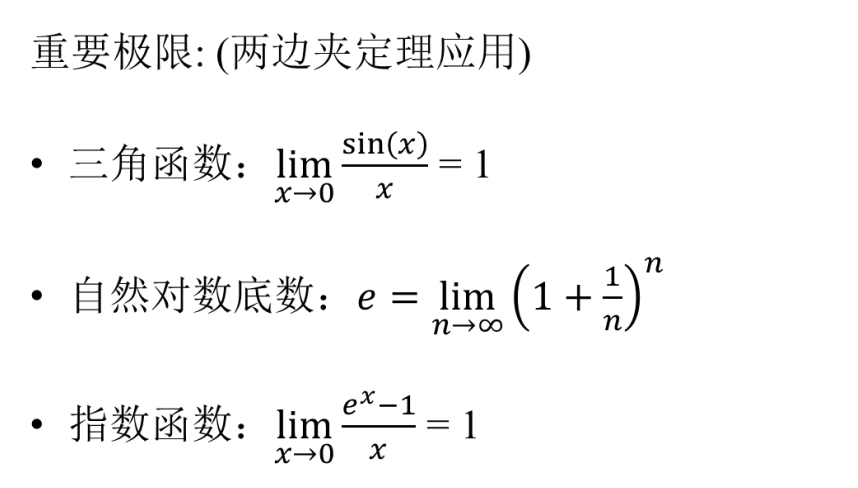
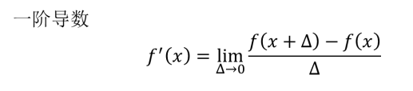
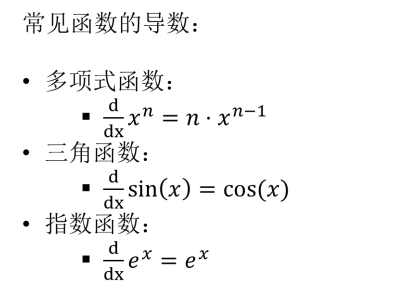
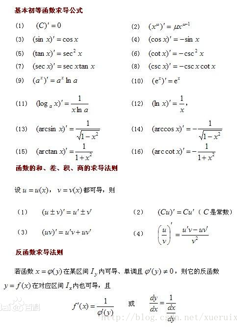
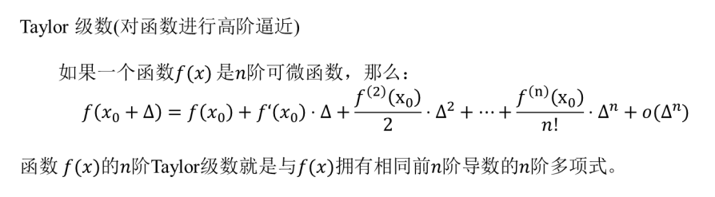
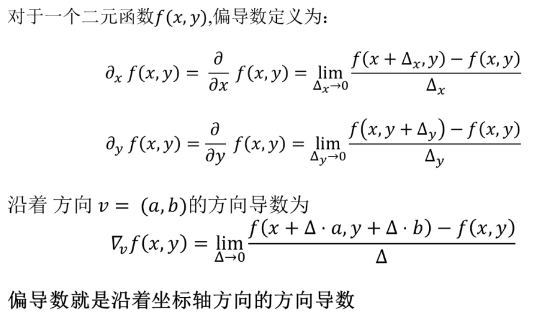
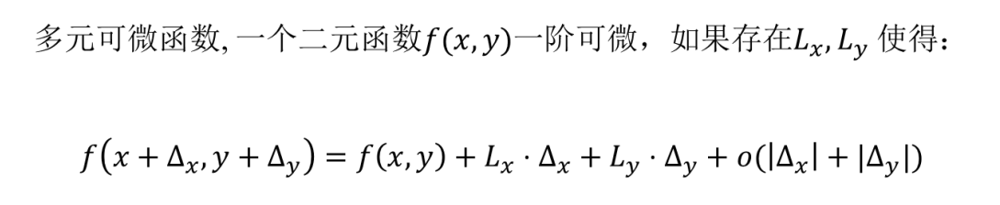
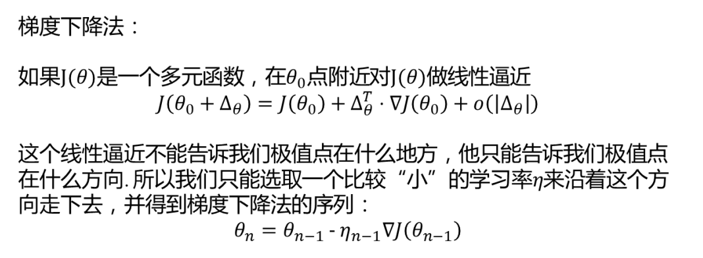

# 微分学基础
- 机器学习过程
    1. 观察参数
    2. 选择模型
    3. 训练(调整参数)
    4. 应用
- 微积分: 用熟悉且简单的函数对复杂函数进行局部逼近
    - 常用作逼近的简单函数
        - 线性函数(一次函数)
        - 多项式函数(不仅仅是一次还有还有多次): 泰勒级数
- 趋于0的极限称为无穷小
- 趋于0的速度越快的无穷小,其阶数越高
- 两边夹定理
    - 如果`f(x)<g(x)<h(x)`三个函数在a点都有极限,那么f,g,h在a点的极限分别`f <= g <= h`

    

- 微积分

    

    - 几何意义: 用直线逼近曲线
    - 代数意义: 用线性函数逼近复杂函数

- 常见导数

    
    

- n阶导数的导数就是n+1阶导数

- 泰勒级数
    - 做这个高精度逼近的原因?

    

- 多元函数的偏导数
    
- 多元函数的逼近
    
    - Lx和Ly分别指的是对x和对y的偏导数

    

- 梯度
    - 梯度下降法
    

    - 梯度的几何意义: 梯度的方向就是增长最快的方向
    - 梯度的反方向: 减少最慢的方向
    - 梯度下降: 找到局部最优点