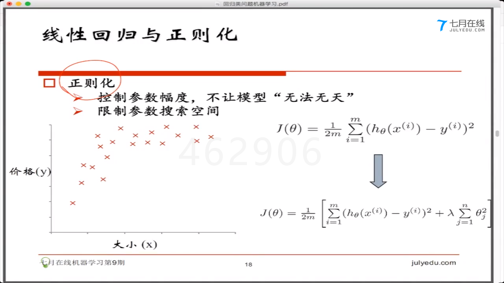

# 回归问题与应用
- 常见的算法
    1. `linear regression` 线性回归
    2. `logistic regression` 逻辑回归
- 机器学习
    - 有监督学习
        - 分类问题(选择题)
            1. 根据数据样本上抽取的特征,判定其属于有限个类别中的哪一个
            2. 垃圾邮件
            3. 图像识别分类
        - 回归问题(问答题)
    - 无监督学习
        - 聚类问题
            1. 从样本上抽取特征,挖掘数据的关联关系
            2. 相似用户挖掘
            3. 新闻聚类

- 线性回归
    - 单变量
        - 身高体重规律
        - 面积和价钱的规律 
        - `y=ax+b`
    - 多变量
        - 身高体重年级
        - 多维的平面
    - 每一列都是一个因素,属性,特征
    - 每一行是一个样本
    - 数据驱动 = 数据 + 模型
    - 模型 = 假设函数 + 优化(优化 = 损失函数 + 优化算法)

    - *损失函数*(代价函数,客观度)
        - 用来做优化的函数
            
        - 其实就是求损失函数的最小值,越小时这个假设函数越好
        - 多元的情况(曲面的最低点)
    - 优化算法
        - 梯度下降
            - 逐步求最小值
                
                
                
        - 梯度下降与学习率(超参数)

            

            - α太大的话可能会直接跳过最低点
            - α取太小的话就会很耗时间
    
    - 回归与 *欠/过拟合*

        

        - 1->欠拟合(学习能力不够),3->过度拟合(学习能力太强)
    
    - 回归与正则化
        - 控制参数幅度,不让参数无法无天
            
        
        - λ(超参数)控制θ的幅度

- 逻辑(斯蒂)回归
    - 肿瘤大小与是否是恶性肿瘤
    - sigmoid函数
        
    - sigmoid的导数是 `g'(z) = g(z)[1-g(z)`
    
    - 判定边界
        - 区分不同的样本点
        - 线性寻找判定边界1
            

        - 非线性寻找判定边界2
            

    - 二分类与多分类

- 损失函数优化算法求θ
    
- 损失函数
    - 下面这个损失函数是凸函数,可以求最小值
    

- LR线性回归应用经验
    