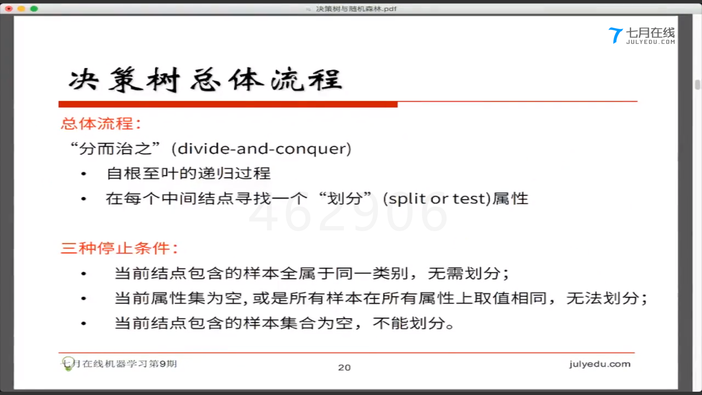
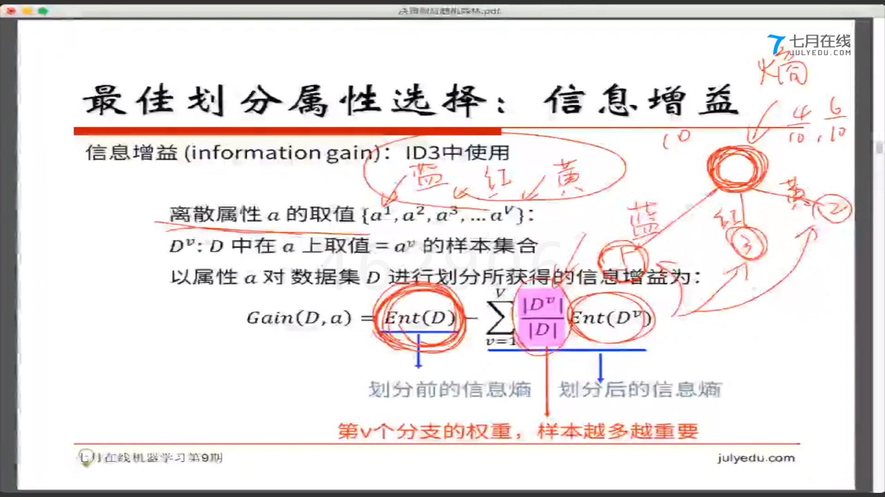
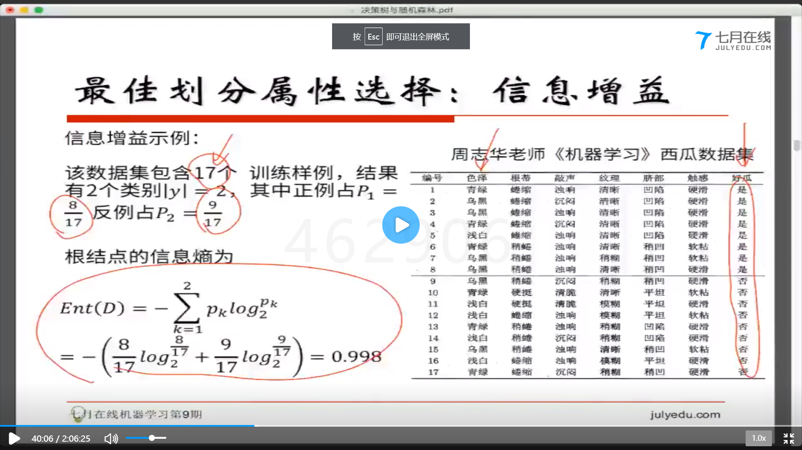
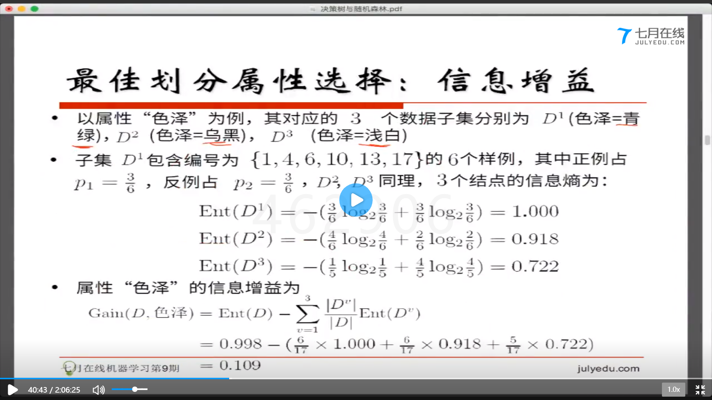
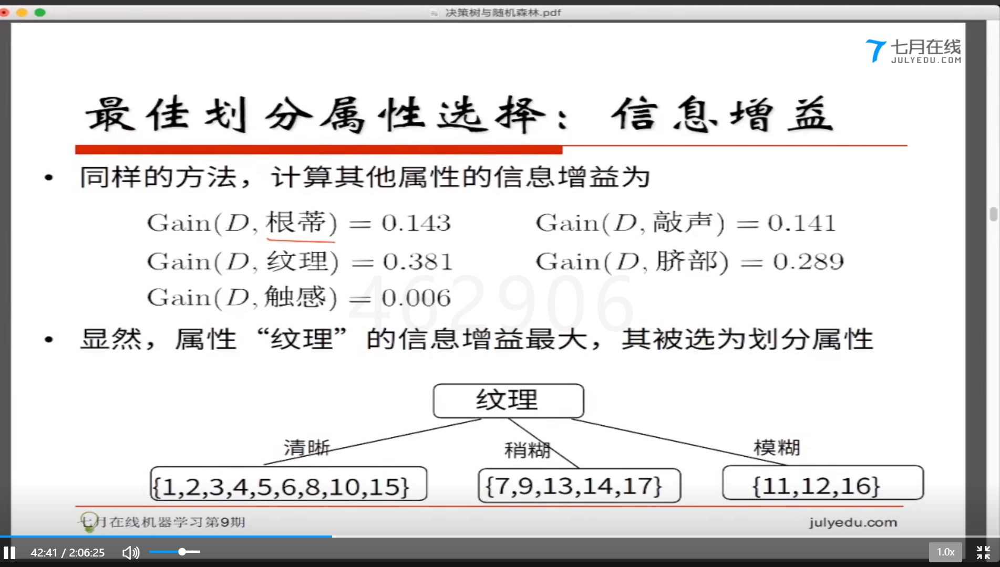
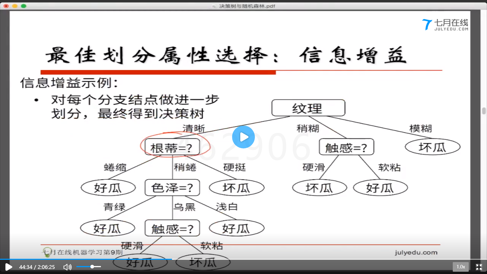
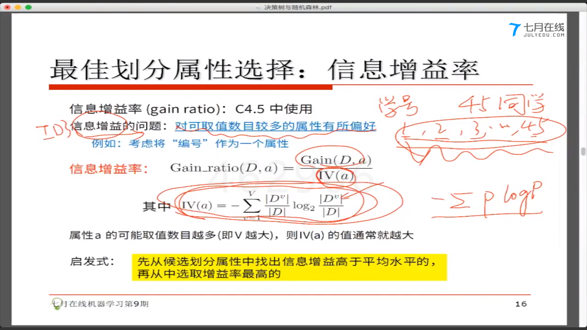
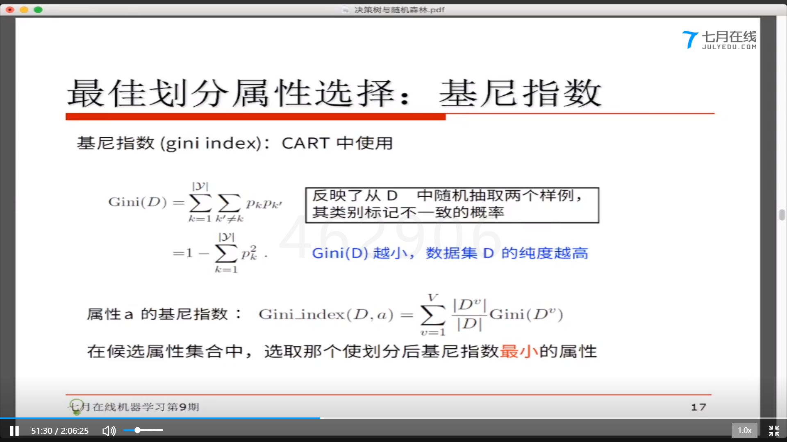
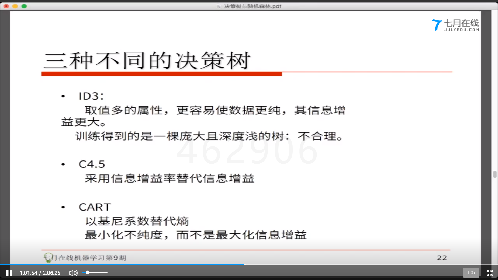

# 决策树与随机森林
- 目录
    - 从lr到决策树
        - 总体流程与核心问题
        - 熵,信息增益,信息增益率
    - 回归树
        - 构建回归树
        - 最优化回归树
    - 从决策树到随机森林

- 总体流程
    
- 熵
    

    - 信息熵: 度量样本集合的纯度的指标
        - Ent取最大值时,不纯度最低,所有样本的比例相同
        - y表示有多少个类别(例如好瓜和坏瓜,类别就是2)
        - 机器学习的目的就是让不纯度降低
    - 信息增益(最佳划分属性选择)(ID3)
        

        - 得到的结果表示,不纯度有没有降低,降低了多少

        - 例子
            

            - 不确定度降低了0.109
            

            - 纹理的不纯度下降的最高,作为划分属性
            

            - 决策树
            
    - ID3的问题
        - 例如学号id的分叉
        - 信息增益率(ID4.5)
        

    - 选择划分属性选择,基尼系数(cart 二叉树)
        - gini越低,不纯度越低
        

- 三种树
    