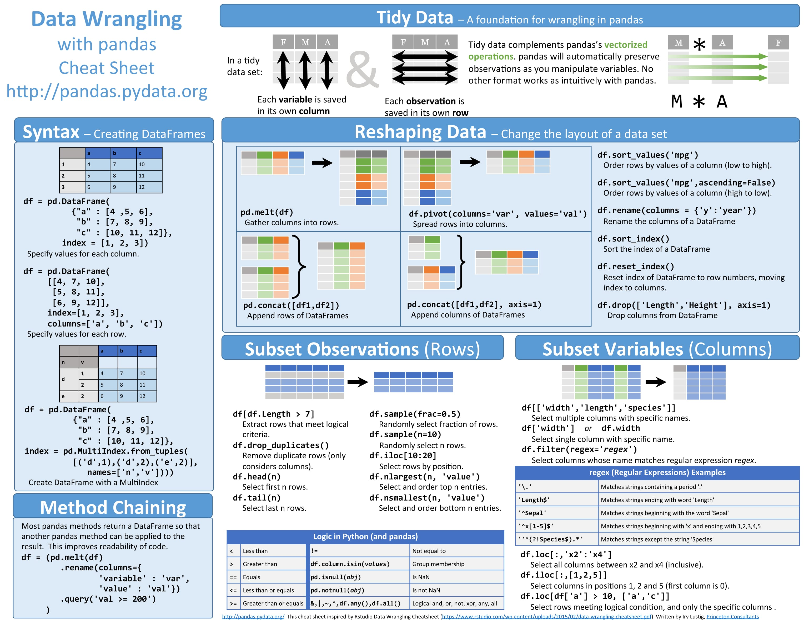

# panda和matplotlib

## pandas



### pandas
- 以列为核心,一行是一个样本
- 取哪一列
    - `pd.salary`
    - `pd['salary']`
- `apply(func, *args)` 对每一行的某列进行操作,操作内容在函数里
    - `pd.salary.apply(test, 'qwe')`


- `Series` 看成列
    ```
    df1 = pd.Series({'a': 1, 'b': 2, 'c': 3}, index=['a', 'b'])
    df2 = pd.Series({'a': 10, 'b': 20, 'c': 30}, index=['a', 'b', 'c'])
    print(df1 + df2)
    print(df1)
    print(df2)
    ```

- `DataFrames`

- 案例1
    ```
    df = pd.read_csv('./DataAnalyst.csv', encoding='gb2312')
    arr = df.salary.str.split('-')
    arr_df = pd.DataFrame(arr.tolist(), columns=['bottom', 'top'])
    arr_df['top'] = arr_df['top'].str[:-1]
    arr_df['bottom'] = arr_df['bottom'].str[:-1]
    arr_df.head()


    # 加工salary字段
    def get_salary(salary, method='None'):
        arr = salary.split('-')
        if len(arr) == 1:
            bottom = arr[0].upper()
            bottom = bottom[:bottom.find('K')]
            top = bottom
        else:
            bottom = arr[0][:-1]
            top = arr[1].upper()
            top = top[:top.find('K')]
        if method == 'top':
            return top
        elif method == 'bottom':
            return bottom


    df['bottomSalary'] = df.salary.apply(get_salary, method='bottom')
    df.bottomSalary = df.bottomSalary.astype('int')  # 类型转换
    df['topSalary'] = df.salary.apply(get_salary, method='top')
    df.topSalary = df.topSalary.astype('int')  # 类型转换
    df['avgSalary'] = (df['bottomSalary'] + df['topSalary']) / 2

    # print(df.groupby('companyShortName').avgSalary.agg(['count','mean']).sort_values(by='count',ascending=False))
    # select companyShortName,count(*) as count, average(avgSalary) from table group by companyShortName order by count

    # print(df.city.value_counts()) # 按city统计(聚合函数count)
    # print(df.avgSalary.describe()) # 查看平均工资
    # print(df.groupby(['city', 'education']).avgSalary.mean()) # 按city和education分组,查看平均工资的均值, .mean()会自动舍弃非数字列
    # print(df.groupby(['city', 'education']).avgSalary.mean().unstack()) # .unstack()把内层索引展开到列上
    # print(df.groupby('companyShortName').avgSalary.agg(['count', 'mean']).sort_values(by='count', ascending=False)) # agg聚合函数count mean;sort_values(by='', ascending=)根据值或者索引排序ascending升序/降序
    # print(df.groupby('city').companyShortName.value_counts())
    # print(df.groupby('city').positionName.value_counts())

    # def topN(df, n=5):
    #     counts = df.value_counts()
    #     return counts.sort_values(ascending=False)[:n]
    # print(df.groupby(['city']).companyShortName.apply(topN))
    ```
- 案例2_1
    ```
    df = pd.read_csv('./2016-us-ge-by-county.csv')
    df.drop('StateCode', axis=1, inplace=True)
    df.drop('CountyFips', axis=1, inplace=True)
    # print(df)

    trump_df = df[df.Candidate == 'Trump']
    Castle_df = df[df.Candidate == 'Castle']

    # print(trump_df.info())
    # print(Castle_df.info())
    # print(trump_df.head())
    r_df = pd.merge(trump_df, Castle_df, on=['StateName', 'CountyName', 'CountyTotalVote'], suffixes=['_t', '_c'])
    # print(r_df.columns)
    r_df.drop('Party_t', axis=1, inplace=True)
    r_df.drop('Party_c', axis=1, inplace=True)
    r_df.drop('Candidate_t', axis=1, inplace=True)
    r_df.drop('Candidate_c', axis=1, inplace=True)
    # print(r_df.columns)
    r_df.columns = ['StateName', 'CountyName', 'TotalVote', 'VoteTrump', 'VoteClinton']

    # r_df.drop([0], inplace=True) # 删除第0行
    # print(r_df.head(10))
    # print(r_df.groupby(by='StateName').sum().head(10))
    r_df = r_df.groupby(by='StateName', as_index=True).sum().head(100)
    # print(r_df.groupby(by='StateName', as_index=True).sum().head(10))
    r_df['t_ratio'] = r_df['VoteTrump'] / r_df['TotalVote']
    r_df['c_ratio'] = r_df['VoteClinton'] / r_df['TotalVote']
    r_df['winner'] = list(map(lambda x,y:'trump' if x > y else 'clinton',r_df['t_ratio'],r_df['c_ratio']))
    print(r_df[['t_ratio', 'c_ratio', 'winner']])
    ```
- 案例2_2
    ```
    df = pd.read_csv('./2015-us-income-by-county.csv')
    res_df = pd.merge(df, r_df, on='StateName')
    # print(res_df[['StateName','TotalVote','VoteTrump','VoteClinton','t_ratio','c_ratio','winner','Income']])

    plt.rcParams['font.sans-serif'] = ['SimHei']  # 用来正常显示中文标签
    colors = res_df.winner.map({'trump': 'Red', 'clinton': 'Blue'})  # 根据赢家设置颜色

    spot_size = res_df.TotalVote / 4000.0  # 设置点大小
    plt.figure(figsize=(17, 12))
    plt.scatter(x=res_df['Income'],
                y=res_df['t_ratio'],
                s=spot_size,
                c=colors,
                alpha=0.25 # 透明度
                )
    plt.scatter(x=res_df['Income'], y=res_df['c_ratio'], s=spot_size, alpha=0.25)
    plt.xlabel('人均收入（美元）', fontsize=20)
    plt.ylabel('各州Trump得票比率', fontsize=20)
    plt.grid(True)  # 添加网格
    plt.show()
    ```
## matplotlib


### matplotlib
- 案例1_1
    ```
    plt.figure(figsize=(8, 6))

    plt.subplot(2, 2, 1) # 从2X2的网格创建一个子图片

    X = np.linspace(-np.pi, np.pi, 256, endpoint=True)
    C, S = np.cos(X), np.sin(X)

    # 用宽度为1（像素）的蓝色连续直线绘制cosine
    plt.plot(X, C, color="blue", linewidth=1.0, linestyle="-")

    # 用宽度为1（像素）的绿色连续直线绘制sine
    plt.plot(X, S, color="green", linewidth=1.0, linestyle="-")

    # 设置x轴的极值
    plt.xlim(-4.0, 4.0)

    # 设置x轴的刻度值
    plt.xticks(np.linspace(-4, 4, 9, endpoint=True))

    # 设置y轴的极值
    plt.ylim(-1.0, 1.0)

    # 设置y轴的刻度值
    plt.yticks(np.linspace(-1, 1, 5, endpoint=True))

    # 在屏幕上显示结果
    plt.show()
    ```
- 案例1_2
    ```
    # 移动轴和图例
    ax = plt.gca()  # gca stands for 'get current axis'
    ax.spines['right'].set_color('none') # 设置右侧的框
    ax.spines['top'].set_color('none') # 设置顶部的框
    ax.xaxis.set_ticks_position('bottom') # 设置底下的线为x轴
    ax.spines['bottom'].set_position(('axes',0.5)) # 设置底部面的框
    ax.yaxis.set_ticks_position('left') # 设置左侧的线为y轴
    ax.spines['left'].set_position(('data',0)) # 设置左侧的框
    plt.setp(ax,
            xticks=[-np.pi, -np.pi/2, 0, np.pi/2, np.pi],
            xticklabels=[r'$-\pi$', r'$-\pi/2$', r'$0$', r'$+\pi/2$', r'$+\pi$'])
    plt.setp(ax,
            yticks=[-1, 0, +1],
            yticklabels=[r'$-1$', r'$0$', r'$+1$'])
    ax.plot(X, C, color="blue", linewidth=1.0, linestyle='-', label='cos')
    # 用宽度为1（像素）的绿色连续直线绘制sine
    ax.plot(X, S, color="green", linewidth=1.0, linestyle='-', label="sin")
    ax.legend(loc='upper left') # 顺序要在plot后面,位置设置在左上角
    # 特殊点标注
    t = 2 * np.pi / 3
    ax.annotate(r'$\sin(\frac{2\pi}{3})=\frac{\sqrt{3}}{2}$',
                xy=(t, np.sin(t)), xycoords='data',
                xytext=(+10, +30), textcoords='offset points', fontsize=16,
                arrowprops=dict(arrowstyle="->", connectionstyle="arc3,rad=.2"))
    ax.annotate(r'$\cos(\frac{2\pi}{3})=-\frac{1}{2}$',
                xy=(t, np.cos(t)), xycoords='data',
                xytext=(-90, -50), textcoords='offset points', fontsize=16,
                arrowprops=dict(arrowstyle="->", connectionstyle="arc3,rad=.2"))
    ax.scatter([t,], [np.sin(t),], 50, color ='green')
    ax.scatter([t,], [np.cos(t),], 50, color ='blue')
    plt.show()
    ```

- 案例2
    ```
    # 图嵌套
    x = np.linspace(0, 5, 10)
    y = x ** 2

    fig = plt.figure()

    # axes = fig.add_axes([0.1, 0.1, 0.8, 0.8]) # left, bottom, width, height (range 0 to 1)
    axes = fig.gca()
    axes2 = fig.add_axes([0.2, 0.5, 0.4, 0.3]) # 内部图的四个角相对于外部图的比例

    axes.plot(x, y, 'r')

    axes.set_xlabel('x')
    axes.set_ylabel('y')
    axes.set_title('title')

    # insert
    axes2.plot(y, x, 'g')
    axes2.set_xlabel('y')
    axes2.set_ylabel('x')
    axes2.set_title('insert title');

    plt.show()
    ```


- 案例3(雷达图)
    ```
    def radar_plot():
        """
        radar plot
        """
        # 生成测试数据
        labels = np.array(["A", "B", "C", "D", "E", "F"])
        data = np.array(np.random.randint(0, 100, 6))
        theta = np.linspace(0, 2 * np.pi, len(data), endpoint=False)

        # 数据预处理
        data = np.concatenate((data, [data[0]])) # 为了封闭图形
        print(data)
        theta = np.concatenate((theta, [theta[0]])) # 为了封闭图形
        print(theta)

        # 画图方式
        plt.subplot(111, polar=True)
        plt.title("Radar")

        # 设置"theta grid"/"radar grid"
        plt.thetagrids(theta * (180 / np.pi), labels=labels)
        plt.rgrids(np.arange(20, 100, 20), labels=np.arange(20, 100, 20), angle=0)
        plt.ylim(0, 100)

        # 画雷达图,并填充雷达图内部区域
        plt.plot(theta, data, "bo-", linewidth=2)
        plt.fill(theta, data, color="red", alpha=0.25)

        # 图形显示
        plt.show()
        return
    # radar_plot()

    ```

- 案例4(饼图)
    ```
    def pie_plot():
        """
        pie plot
        """
        # 生成测试数据
        sizes = [15.88, 29.12, 45, 10]
        labels = ["Frogs", "Chinese", "Dogs", "Logs"]
        colors = ["yellowgreen", "gold", "lightskyblue", "lightcoral"]

        # 设置标题
        plt.title("Pie")

        # 设置突出参数
        explode = [0, 0.1, 0, 0]

        # 画饼状图
        patches, l_text, p_text = plt.pie(sizes,
                                        explode=explode,
                                        labels=labels,
                                        colors=colors,
                                        autopct="%.2f%%",
                                        shadow=True,
                                        startangle=180)
        plt.axis("equal")

        # 图形显示
        plt.show()
        return

    pie_plot()
    ```

- 案例5