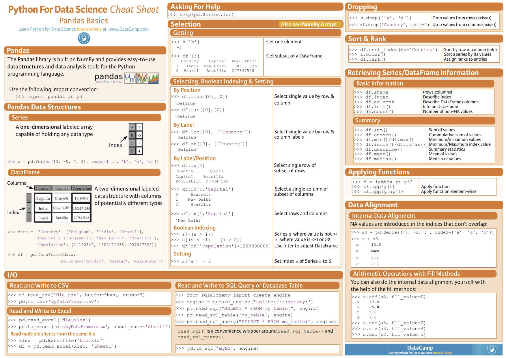

# panda和matplotlib

## pandas

### pandas
- 以列为核心,一行是一个样本
- 取哪一列
    - `pd.salary`
    - `pd['salary']`
- `apply(func, *args)` 对每一行的某列进行操作,操作内容在函数里
    - `pd.salary.apply(test, 'qwe')`
## matplotlib

### matplotlib