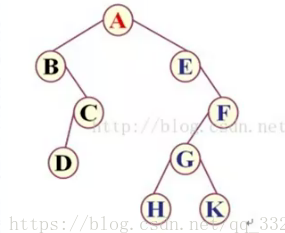
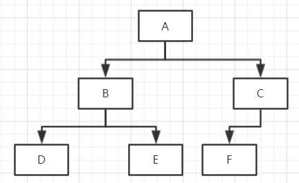

# 树/堆
## 树
- 树:任意两点存在唯一一条路径
- 二叉树:每个节点最多只有两个分支的树结构
- 完全二叉树:只有最下层和次下层有叶子节点
- 平衡二叉树:空树或者左右两个子树的高度差绝对值小于等于1,并且左右两个子树都是一棵平衡二叉树
- 应用
    - 快速数据检索
        - STL的红黑树
        - 数据库的B+树
    - 文档结构组织: DOM
    - 人工智能: 决策树
        - 支付宝风控
    - [游戏: 通过构造空间树实现快速碰撞检测](https://www.zhihu.com/question/25111128)
    - 区块链的默克尔树
        - 100W条数据有1-2条被篡改,如何快速找到被修改的记录

- 常用算法
    - 递归
    - 树的深度优先遍历
    - 根节点 -> 左子树 -> 右子树




- 前序遍历(ABCDEFGHK)
- 中序遍历(BDCAEHGKF)
- 后序遍历(DCBHKGFEA)

- 非递归实现中序遍历
    1. 初始化空的ret和堆栈
    2. if root不为空 或者 堆栈不为空
        1. 当root不为空的时候root压入堆栈
        2. root = root.left
        3. 如果root不为空则回到2
        4. 如果堆栈不为空
        5. 弹出元素,加入返回队列ret
        6. root = root.right

    

    3. 实现

    

        ```
        # 造树
        class BinaryTreeNode(object):
            def __init__(self, data=None, left=None, right=None):
                self.data = data
                self.left = left
                self.right = right
        n1 = BinaryTreeNode(data="D")
        n2 = BinaryTreeNode(data="E")
        n3 = BinaryTreeNode(data="F")
        n4 = BinaryTreeNode(data="B", left=n1, right=n2)
        n5 = BinaryTreeNode(data="C", left=n3, right=None)
        root = BinaryTreeNode(data="A", left=n4, right=n5)

        # 
        class Solution:
            def __init__(self):
                self.ret = []

            """
            @param root: The root of binary tree.
            @return: Preorder in ArrayList which contains node values.
            """
            # 中序遍历
            def inorderTraversal(self, root):
                # write your code here
                if root is not None:
                    self.inorderTraversal(root.left)    # 遍历左子树
                    self.ret.append(root.data)
                    self.inorderTraversal(root.right)   # 遍历右子树
                return self.ret

            # 非递归的中序遍历
            def zxtree(root):
                ret = []
                stack = []
                while stack or root:
                    if root:
                        stack.append(root)
                        root = root.left
                    else:
                        root = stack.pop()
                        ret.append(root.data)
                        root = root.right
                return ret

            # 非递归的前序遍历
            def preorderTraversal(root):  ## 前序遍历
                stack = []
                sol = []
                while stack or root:
                    if root:
                        sol.append(root.data)
                        stack.append(root.right)
                        root = root.left
                    else:
                        root = stack.pop()
                return sol

            # 非递归的后序遍历
            def postorderTraversal(root):  ## 后序遍历
                stack = []
                ret = []
                while stack or root:
                    if root:
                        ret.append(root.data)
                        stack.append(root.left)
                        root = root.right
                    else:
                        root = stack.pop()
                return ret[::-1]
            
        ```
- 翻转二叉树
    - 左子树和右子树交换位置
    - 实现
        ```
        # 翻转二叉树递归
        def invertTree(self, root):
            """
            :type root: TreeNode
            :rtype: TreeNode
            """
            if not root:
                return None
            newRoot = TreeNode(root.data)
            newRoot.left = self.invertTree(root.right)
            newRoot.right = self.invertTree(root.left)
            return newRoot

        # 翻转二叉树非递归
        def invertTree(self, root):
            if not root:
                return
            stack = [root]
            while stack:
                curr = stack.pop()
                curr.left, curr.right = curr.right, curr.left
                if curr.left:
                    stack.append(curr.left)
                if curr.right:
                    stack.append(curr.right)
            return root
        ```


