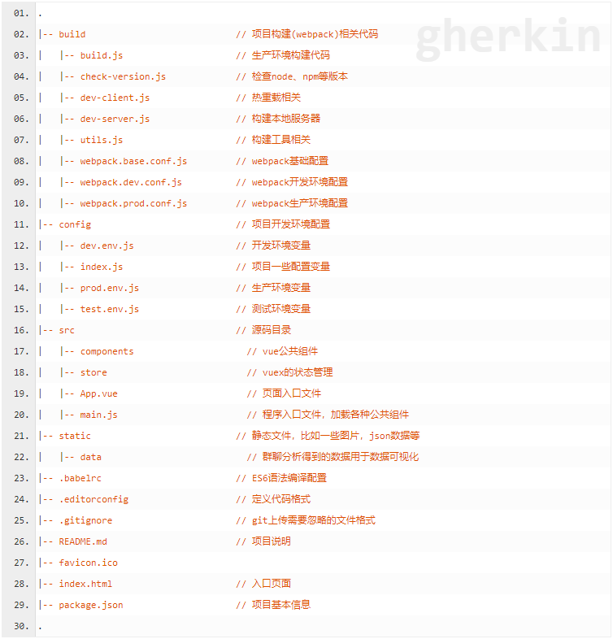

# vue-cli脚手架
## 环境
- `cnpm install vue-cli -g` 全局安装vue-cli
- `vue -V` 查看vue版本
- `vue init <template-name> <project-name>`
    - 模板名称`webpack webpack-simple`等
- `npm run dev`热启动
- `npm run build`打包
    
## 项目目录
- 项目结构

[目录及文件的详细介绍](http://jspang.com/post/vue-cli2.html#toc-54a)


- `build`项目构建(webpack)相关代码
    - `webpack.base.conf.js`
        - `entry`入口文件
        - `output`出口文件
- `config`项目开发环境配置
- `src`源码目录
- `static`静态文件，比如一些图片，json数据等
- `.babelrc`ES6语法编译配置
    ```
    {
        "presets": [
            ["env", {
                "modules": false,
                "targets": {
                    "browsers": ["> 1%", "last 2 versions", "not ie <= 8"]
                }
            }],
            "stage-2"
        ],
        "plugins": ["transform-vue-jsx", "transform-runtime"]
    }
    ```
- `editorconfig`定义代码格式

- `gitignore`git上传需要忽略的文件格式
- `index.html`入口页面
- `package.json`
    - `dependencies`生产环境中依赖的包
    - `devDependencies`开发环境中依赖的包


