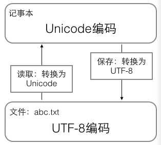

# python的解释器
1. 官方CPython: C语言开发,最广泛的解释器
2. IPython: 一个交互式,功能增强的Cpython
3. PyPy: Python语言写的Python解释器,JIT(just in time)技术,**动态**编译Python代码
4. Jython: Python的源代码编译成Java的字节码,跑在JVM(java 虚拟机)上
5. IronPython: 与Jython类似,运行在.Net平台上的解释器,Python代码被编译成.Net字节码

# 基础知识
## 数据类型
### 数字
1. 整数
    1. 不区分`long`和`int`
    2. 长度没限制
    3. 进制(十六进制 0x;二进制 0b)
    4. 布尔, True(1), False(0)
2. 浮点型(科学计数法)
    1. 1.23*10<sup>9</sup>等于`1.23e9`
    2. 浮点型计算是不精确的,例如`1.2 - 1`得到0.19999999999999996
        1. 精确小数计算
```
# 定点数(精确小数)
import decimal
a = decimal.Decimal('1.2')
b = decimal.Decimal('1')
print(a - b)
```
### 字符串
1. 使用'或",使用'''或"""可跨行
2. 字符串前加r或者R,表示字符串不做特殊处理(不做转义)

### 总结
1. `int str bool float complex tuple bytes`不可变
2. `list set dict bytearray`可变

## 基础语法
### 转义字符
1. `\n`换行
2. `\t`制表符
3. `\b`退格BackSpace
4. `\r`回车,当前位置移到本行开头(退格到开头)
5. `\0`代表空字符
6. `\a`系统提示音
### 缩进
1. 4空格缩进
### 续行
1. 在行尾使用\
2. 如果使用各种括号,认为括号内是一个整体,内部跨行不用\
### 标识符
1. 字母,下划线和数字组成
2. 字符或下划线开头
3. 不能是关键字
4. 大小写敏感
### 常量
1. python无法定义常量
### 字面常量
1. 一个单独的量,例如`12,'abc'`(放在内存中固定不变的)
### 变量

## Python语言类型
1. Python是**动态**语言,**强类型**语言
2. 静态编译语言: 事先声明变量类型,类型不能改变,编译时检查
3. 动态编译语言: 不用事先声明类型,随时可以赋值为其他类型,编程时不知道是什么类型
4. 强类型语言: 不同类型之间操作(例如打印),必须转成同一类型
5. 弱类型语言: 不同类型之间可以隐式转换(JS打印)

## 运算符
### 算数运算符
`+ - * / //(整除) % **(幂)`
#### math模块

### 位运算符
`&(与: 都是1才为1,否则为0) |(或: 都是0才为0,否则为1) ~(位运算符非) ^(异或: 相同取0,不同取1) <<(左移) >>(右移)`
1. `~`: 12的二进制为1100,按位取反后为1101,十进制则为-13
1. `&`与: 都是1才为1,否则为0
2. `|`或: 都是0才为0,否则为1
3. `~`非: 按位取反再加1
4. `^`异或: 相同取0,不同取1
5. `<<`左移: 乘以2的x次方,`9<<2`等于`9*4=36`
6. `>>`右移: 除以2的x次方

### 比较运算符
1. `== != > < >= <=`
2. 返回布尔值
3. `1 < '1' Fales`比较数据类型, `1 < 'a' 报错`类型不一致, `'1' > '2' False`比较ASCII码
4. `4 > 3 > 1`链式比较
### 赋值运算符
1. `a = min(3, 5)`
2. `+= -= *= /= %= **= //=`
3. `x = y = z = 1`
### 身份运算符
1. `is, is not`
2. `isinstance(obj, 对象类型)` 判断是否有构造关系
### 成员运算符
1. `in, not in`
### 逻辑运算符
1. 与或非`and or not`
2. 短路运算符
    1. and: 如果第一个表达式为False,后面就没必要计算了,则逻辑表达式一定为False
    2. or: 如果第一个表达式True,后面就没有必要计算了,表达式一定为True
3. not > and > or

### 原码,反码,补码,负数
#### 原码(对人友好)
1. 5 => 0b101, 1 => 0b1, -1 => -0b1, bin(-1), 在最高位为0时表示正数,最高位为1时表示负数
#### 反码
1. 正数的反码与原码相同
2. 负数的反码**符号位不变**其余按位取反
#### 补码(计算机使用)
1. 正数的补码与原码相同
2. 负数的补码**符号位不变**其余按位取反后加1
#### 负数表示法
1. 数字电路的CPU的运算器实现了加法器,但是没有减法器,减法是转换成加法
2. 负数在计算机中使用补码存储, -1的补码是1111 1111(8位是一个字节)
3. 5-1 => 5+(-1)直觉上是0b101-0b1,其实计算机中是0b00000101 + 0b11111111,溢出位舍弃


## 字符串和编码
### 字符编码
计算机只能处理数字, 如果要处理文字, 就要把文字转换成数字, 最早计算机设计是8个比特(bit)作为一个字节(byte),所以一个字节的最大整数是255,比如两个字节能表示的最大整数是65535

ASCII码指的是字母和一些字符,例如A是65

中国制定GB2312编码,把中文编进去.而其他国家有各自的标准,混合使用会出现乱码

而Unicode统一了所有的编码,Unicode通常用两个字节表示一个字符,而ASCII编码是一个字节

字符`A`的ASCII编码是十进制的65,二进制的`01000001`;<br>
字符`0`的ASCII编码是十进制的48,二进制的`00110000`;<br>
汉字`中`已经超出ASCII编码的范围,用Unicode编码是十进制的20013,二进制的`01001110 00101101`<br>
把ASCII编码的`A`用Unicode表示,只需要在前面补零,然而英文全部用Unicode表示的话需要多一倍的存储空间,所以Unicode出现"可变编码长"->`utf-8`,`utf-8`把Unicode字符根据不同的数字大小编码成1-6个字符,常用的英文字母被编码成1个字节,汉字通常是3个字节,生僻的字符被编码成4-6个字节,因此用utf-8传输英文字符就能节省空间

|字符|ASCII|Unicode|utf-8|
|:-:|:-:|:-:|:-:|
|A|01000001|00000000 01000001|01000001|
|中|x|01001110 00101101|11100100 10111000 10101101|

结论:<br>
在计算机内存中，统一使用Unicode编码，当需要保存到硬盘或者需要传输的时候，就转换为UTF-8编码<br>
用记事本编辑的时候，从文件读取的UTF-8字符被转换为Unicode字符到内存里，编辑完成后，保存的时候再把Unicode转换为UTF-8保存到文件



### python字符串
python的字符串类型是str,在内存中是Unicode表示,一个字符对应若干个字节,如果要在网络上传输,或者保存在磁盘中,就需要把str变为以字节为单位的bytes,python对bytes类型的数据用`b`前缀表示,例如
```
x = b'ABC'
bytes(b'abc') # 二进制字符串对象
bytearray(b'a') # 二进制字符串数组对象
```
解码与编码:
```
# b'ABC'
print('ABC'.encode('ascii'))
# 报错,因为ascii不理解中文
print('中'.encode('ascii'))

# b'ABC'
print('ABC'.encode('UTF-8'))
# b'\xe4\xb8\xad'
print('中'.encode('UTF-8'))
```
```
print(b'\xe4\xb8\xad'.decode('utf-8'))
print(b'ABC'.decode('utf-8'))
```
```
# URL编码
from urllib import parse
s = '中国'
print(parse.quote(s))
```

### 字符串的使用
1. `len()`
len计算str的字符数,计算bytes的字节数
```
# 3
print(len(b'\xe4\xb8\xad'))

# 2
print(len('AB'))
```

2. 字符串方法(不改变原字符串)
    1. 查
        1. `str.index(value)`
        2. `str.count(value)`
        3. `str.find(value, a, b)`从下标a-下标b(a,b可选参数)开始获取value的下标,未找到返回-1
        4. `str.isdigit()`判断字符串中是否全部都是数字
        5. `str.isalpha()`判断字符串中是否全部都是字母
        6. `str.endswith(value)`判断字符串是否以value开头
        7. `str.startswith(value)`判断字符串是否以value开头
        8. `str.islower()`
        9. `str.isupper()`
    2. 改(返回新的字符串)
        1. `str.upper()`将字母大写并返回字符串
        2. `str.lower()`
        3. `str.strip()`去除两边空格
        4. `str.lstrip()`
        5. `str.rstrip()`
        6. `str.capitalize()`下标为0的字符大写
        7. `str.title()`将单词首字母大写
        8. `str.split(value, x)`以value为界切割x(可选)次后返回list列表,不填参数默认切割空格
        9. `str.join(list/tuple)`返回组合的字符串
        10. 
    3. 删
        1. `str.replace(old, new, x)`在字符串中将x个old替换成new
    4. 增
        1. `拼接`

3. 字符串拼接
    1. 拼接
        1. `'123 %s %s'%(123, 456)`      
        2. `'%.1f'%1.23`一位小数
        3. `'%-6.1f'%1.23`一位小数,后补齐6个字符
        4. `'%6.1f'%1.23`一位小数,前补齐6个字符
    2. `format()`
        >`'{0}的成绩提升了{1:.1f}分'.format('小明',21,45123)`小明的成绩提升了21.0分
        
        > `'123{0}{1}'.format(456, 789)'`

        > `'{0}{1}{a}'.format('000','111', a = '123')`

        > `'{a:^10.2f} {0} {b:.2%}'.format(1.2345, a = 2.345, b = 3.45)`^/</>(居中/左/右)对齐

        > `a = '123{}'.format print(a(456))`把`'123{}'.format`当做一个函数
    3. `format_map(dict)`
        >`'123{a}{b}'.format_map({ 'a': 1,'b': 2})`
4. 字符串格式化
    1. 占位符

        |占位符|替换内容|
        |:-:|:-:|
        |%d|整数|
        |%f|浮点型|
        |%s|字符串|
        |%r|与%s类似,但是打印时不会去掉字符串的引号|
        |%x|十六进制整数|
        |%c|ascii码|
        |%o|八进制|
        |%e|科学计数|

        >`'%s is %d years old,he has %.1f money' %('tom', 1000, 1.1)` tom is 1000 years old,he has 1.1 money


## 使用list和tuple
### list
1. `len()`
2. 增
    1. `l.append(value)`
    2. `l.insert(index, value)`
    3. `l.extend(value)`插入str,list或tuple;(拆开分别插入在最后面)
3. 删
    1. `l.pop(index)`通过索引删除(参数不填则默认为-1)
    2. `l.remove(value)`通过值删除(相同元素只删除第一个)
    3. `l.clear()`全部清除
4. 改
    1. `l[index] = value`
5. 查
    1. `l.index(value)`根据value获取下标(重复则取第一个)
    2. `l.count(value)`根据value获取出现次数
6. 其他方法
    1. `l.copy()`浅拷贝(会重新开辟一个内存地址存放这个list,修改内层的list,原list受到影响)
    2. `l.reverse()`反转
    3. `l.sort(reverse = False)`(参数默认为False)表示从小到大排序
7. 切片
    1. `list1[1:4:1]`
    2. `list1[-2:-4:-1]`
8. 列表的**深复制**
    1. 即使修改内层的list,原list不受影响
    2. 例子
        ```
        import copy
        li = ['1', ['2'], 3]
        deeplist = copy.deepcopy(li)
        ```
### tuple
1. 一旦初始化则不能修改,所以更加安全
2. `tuple[index]`
3. 查
    1. `t.index(value)`
    2. `t.count(value)`
4. 只有一个元素的tuple必须加逗号来消除歧义
    1. `t = (1, )`
5. 内部如果某个元素是list,则这个list可以被修改

### 不同类型之间转化
`l = list(s)`
`t = tuple(l)`

## 使用dict和set
### dict
1. 3.6以后是有序的
2. 增
    1. `d.copy()`浅复制
    2. `d.setdefault(key, value)` 设置keyvalue,不填写value则value默认为None,有则查无则增,返回value值
    3. `dict.fromkeys(list1/dict1/set1, v)`提取key与value组成新的字典
3. 删
    1. `d.pop(key)`key必填
    2. `d.popitem()`删除最后一个
    3. `d.clear()`
4. 改
    1. `d.update(d1)`
5. 查
    1. `d[key]`
    2. `d.get(key, msg)`
    3. `d.keys()`
    4. `d.values()`
    5. `d.items()`
6. dict用空间换取查询效率
7. dict的key不可变,这种通过key计算位置的算法称为哈希算法

### set
1. 是key(不可变对象)的集合,但不存储value
2. 创建set时需要list作为输入集合
    1. `s = set([1, 2])`
3. 特性
    1. 没有重复的元素
    2. set是无序的不存在索引取值
    3. 3.6版本以后是可变的
4. 增
    1. `s.add(key)`
5. 删
    1. `s.pop()`删除第一个
    2. `s.clear()`
    3. `s.remove(key)`
6. 改
    1. `s.update()`
7. 查
    1. `s1.isdisjoint(s2)` s1是否与s2没有交集,如果没有交集返回True
    2. `s1.issubset(s2)` s1是否包含于s2
    3. `s1.issuperset(s2)` s1是否包含s2
8. set集合的运算
    1. `& | -`

### 对象的可变性
1. 字符串,数字,tuple是不可变对象.而list,dict等是可变对象,不可以作为key保存
2. 修改不可变对象
    1. 使用切片
    2. 修改可变对象(list等)时,内存地址不变
    3. 强行修改不可变对象(字符串,元祖等)时,内存地址被修改

# 条件控制和循环
1. if三目运算

```
# 打印1或者2
print(1) if a > 1 else 2
```

2. while

循环while
注: break不仅跳出while而且跳出else,continue跳出当前循环,else表示循环完成后执行的语句
```
while 条件:
    code
else:
    code
```

3. for
    1. `for i in obj`只循环**可迭代的对象**(序列类型, 散列类型)
    2. `for i in range(x, y, z)`range(x, y, z)就可以看成可迭代对象, [x, y), z是步长默认为1
```
for i in range(0, 20):
    if i % 5 == 0:
        continue
    print(i)
else:
    print('123')
```

# 函数
1. 默认返回None
2. 返回多个值时实际返回tuple
3. 参数
    1. 必备参数
    2. 默认参数
    3. 不定长参数
        1. `*args`类型为元祖
        2. `**kwargs`类型为字典
4. 传参
    1. 位置传参
    2. 指定传参

```
def test(a, *args, b = 5, **kwargs):
    print(a, args, b, kwargs)

test(1, 2, 3, 4, b = 10, q = 10, w = 11)
test(1, *(2, 3), b = 10, **{'w': 10, 'c': 11})

```

5. 常用内置函数
    1. `dir()`
    2. `min max sum sorted reversed sum`
    enumerate 返回可以枚举的对象
    3. `eval` 运算字符串中的表达式
    4. `exec` 解析字符串
    5. `filter(函数名称, 参数列表)` 默认返回 返回值为True(或者1)时的参数组成的列表
    6. `map(函数名称, 参数列表)` 返回 返回值组成的列表
    7. `zip(序列类型1, 序列类型2)` 将两个序列类型组合成字典
