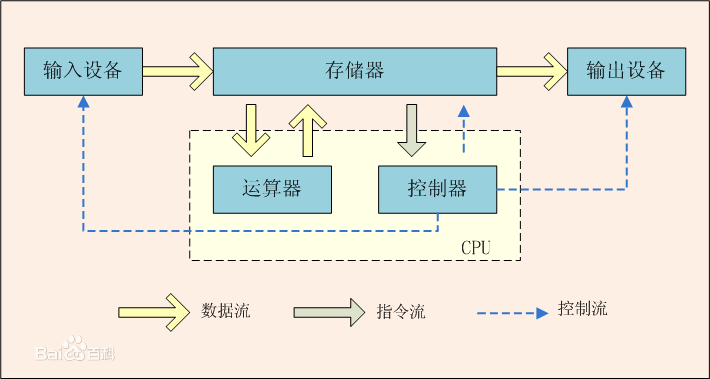

# 冯洛依曼体系

1. CPU由运算器和控制器组成
2. 运算器: 完成算数运算,逻辑运算,数据传输等数据加工处理
3. 控制器: 控制程序的执行
4. 存储器: 用于记忆程序和数据,例如内存
5. 输入设备: 将数据或者程序输入到计算机中,例如键盘鼠标
6. 输出设备: 将数据或者程序的处理结果展示给用户,例如显示器,打印机等
7. 磁盘<=>内存<=>CPU, CPU中的控制器把数据放在内存,再有内存保存在磁盘中,反之亦然
