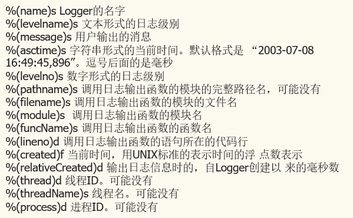
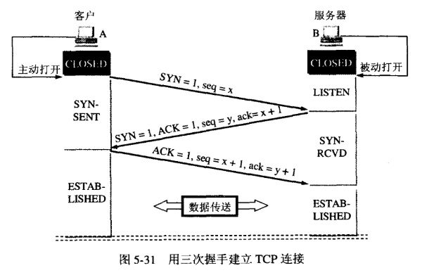
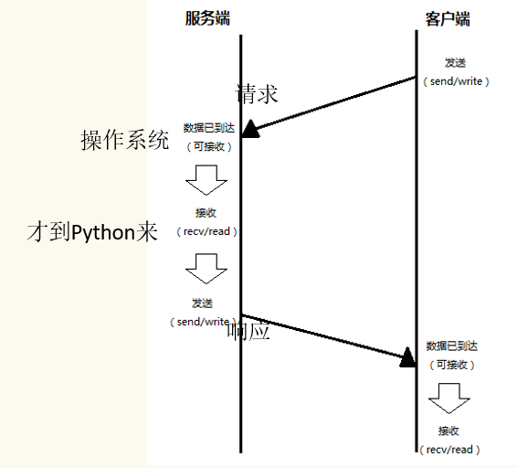
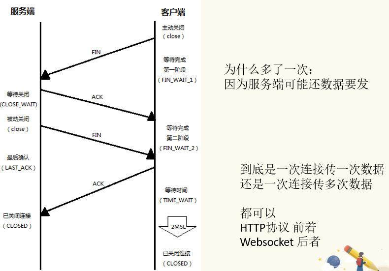
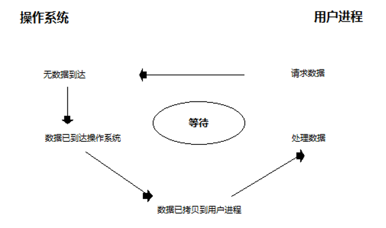
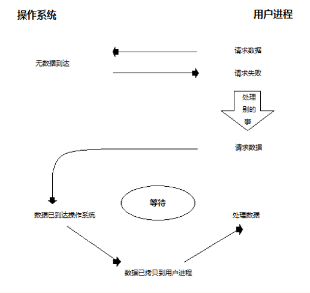

# MySQL
## MySQL基础命令
1. 进入 `mysql -uroot -pqwe123 -hlocalhost -P3306`
2. 创建用户 `create user 'test28'@'%' identified by 'qwe123`
    1. '%'表示这个用户可以从远程登录
3. 赋予权限 `grant all on *.* to 'test28'@'%'`
    1. 第一个`*`表示所有数据库, 第二个`*`表示所有表
4. 使赋予的权限立即生效 `flush privileges`
5. 查看当前用户 `select user()`
6. 查看当前数据库 `select database()`
7. 查看所有数据库 `show databases`
8. 创建数据库 `create database [if not exists] db_name`
9. 使用数据库 `use db_name`
10. 删除数据库 `drop database [if exists] db_name`
11. 创建表 `create table [if ont exists] table_name(column_name data_type(length), ...)`
    1. 整型 int(默认11位)
    2. 不定长 varchar 最长65535
    3. 定长 char 最长255
    4. 双精度 double(4,2)
    5. 可变长度 text 最多65535
    6. 时间 datetime
    7. 枚举 enum
12. 查看有那些表 `show tables`
13. 查看表结构
    1. `describe table_name`
    2. `desc table_name`
    3. `show create table table_name`
14. 删除表 `drop table table_name`
15. `select`查询
    1. `select * from table_name`
16. `insert`增加数据
    1. `insert into table_name value(...)`
    2. `insert into table_name value(...),(...)`
    3. `insert into table_name (id, sex) value(2, 'male')`
17. `update`更新数据
    1. `update table_name set name = 'a' where xxx`
18. `delete`删除数据
    1. `delete from table_name where xxx`
19. `alter`修改字段和键
    1. 修改表名 `alter table tbName rename to NewtbName`
    2. 修改字段名 `alter table tbName change id id1 int`
    3. 增加字段在首位 `alter table tbName add sex varchar(10) first`
    4. 增加字段(在某个字段后) `alter table tbName add address int after sex`
    5. 删除字段 `alter table tbName drop id`

## 表约束和表关系
1. 非空约束
    - 创建表时添加非空约束 `create table tbName(id int not null)`
    - 已经创建表时添加非空约束 `alter table tbName modify id int not null`
    - 取消非空约束 `alter table tbName modify id int`
2. 唯一约束`unique key`
    - 字段对应的值不能重复
    - 添加唯一约束 `create table tbName(id int unique key)`
    - 添加唯一约束 `create table tbName(id int, unique key(id))`
    - 添加唯一约束 `alter table tbName add unique key(id)`
    - 添加唯一约束 `alter table tbName modify id int unique key`
    - 删除唯一约束 `alter table tbName drop key id`
3. 主键约束`primary key`
    - 唯一标识一条数据,每个表一个主键,非空且唯一
    - 当没有主键时,第一个非空且唯一的被视为主键
    - 创建主键 `create table tbName(id int primary key)`
    - 创建主键 `alter table tbName add primary key(id)`
    - 创建主键 `alter table tbName modify id int primary key`
    - 删除主键 `alter table tbName drop primary key`
4. 自增长字段
    - 必须与键一起使用
    - 一个表中一个自增长字段,自增量默认为1,起始值默认为1
    - 创建自增字段 `create table tbName(id int auto_increment)auto_increment=100`
    - 创建自增字段 `alter table tbName modify id int auto_crement`
5. 默认约束
    - 如果`insert`时没有赋值则取默认值
    - `create table tbName(id int default 10)`
6. 外键约束
    1. 外键是另一个表的主键,减少数据冗余
    2. 删除外键 `alter table tbName drop foreign key(s_id)`

```
# 学校
create table school(
    id int primary key,
    name varchar(10) not null
);

# 学生所在的学校
create table student(
    s_id int primary key auto_increment,
    s_name char(10) not null,
    d_id int not null,
    constraint ds_id foreign key(d_id) references school(id)
)

# 学生详细信息
create table student_detail(
    de_id int primary key auto_increment,
    info varchar(10) not null,
    foreign key(de_id) references student(s_id)
)

# 课程信息
create table cours(
    c_id int primary key,
    c_name char(10) not null
)

# 选课表(多对多)学生与课程关联
create table choose(
    cs_id int, # 表示学生
    cours_id int, # 表示课程
    primary key(cs_id, cours_id), # 联合主键(组合唯一且非空)
    foreign key(cs_id) references student(s_id),
    foreign key(cours_id) references  cours(c_id)
)
```

## 查询
### 单表查询
- 模糊查询
```
%: 代表任意个数的字符
_: 代表一个字符
select id 学号,name 姓名 from student where name like '张%'
```
- 排序
```
# 前三条
select * from student order by id asc limit 3

# 第三条的后两条数据
select * from student order by id desc limit 3,2
```
- 聚合函数
    - `MAX MIN SUM AVG ROUND COUNT`

- 分组查询
    - 与聚合函数一起使用
```
select class,count(*) from student
group by class 
having class = 5
```

### 子查询
```
select * from student where age > (select avg(age) from student)
```

### 关联查询
- 内连接: 只会把关联的字段查询和显示出来
```
select * from student inner join student_detail on s_id = sd_id
```

- 外连接
    - 为空的也会查询出来,空用null表示
    - 左外`left join`: 左边为基准,右边少的用null填充
    - 右外`right join`: 右边为基准,左边少的用null填充


# Redis
- 特点
    - Redis是一个基于内存的高性能key-value数据库

- 数据类型
    - string
    - list
    - set
    - zset
    - hash

## 操作
- string
    - 设置一个string`set key value`
        - `set name Sam`
        - 设置存活时间`set key value ex xx`
    - 设置多个string`mset key1 value1 key2 value2`
    - 自增自减

        ```
        set count 0
        incr count # 自增1
        incrby count 30 # 自动30
        decr count # 自减1
        decrby count 30 # 自减30
        ```
    - `get key`
        - `get name`
    - 查看所有键 `keys *`
- list
    - 左边添加 `lpush key value`
        - `lpush l1 1 2 3 4 5`
    - 右边添加 `rpush key value`
    - 查看 `lrange key start end`
    - 左边删除 `lpop key`
    - 右边删除 `rpop key`
    - 指定删除
        - 从后往前(负号)删除一个4 `lrem -1 4`
        - 删除所有4 `lrem 0 4`

- hash(键值对集合)
    - 设置一个哈希类型 `hset key value`
        - `hset user name Sam`
    - 查看 `hget key`
        - `hget user name`
    - 设置多个哈希类型 `hmset key key1 value1 key2 value2`
    - 获取多个哈希类型 `hmget key key1 key2`
    - 获取所有key `hkeys key`
        - `hkeys user`
    - 获取所有value `hvals key`
        - `hvals user`
        - 查看key里面有几组键值对 `hlen key`

- set
    - 添加set `sadd s1 1 2 3`
    - 查看成员 `smembers s1`
    - 在set中指定删除5 `srem s1 5`
    - 随机删除 `spop s1`
    - 移动集合中的元素
        - 将1从s1移动到s2 `smove s1 s2 1`
    - 集合运算
        - 交集 `sinter s1 s2`
        - 查交集并保存到s3 `sinterstore s3 s1 s2`
        - 并集 `sunion s1 s2`
        - 差集 `sdiff s1 s2`
    - 获取集合个数 `scard s1`
    - 随机返回一个 `srandmember s1`

- zset(有序的集合)
    - 添加zset `zadd z1 3 a 4 b 1 c`
        - 3 4 1 表示score分数
        - `{c, a, b}`
    - 查看zset(从小到大): `zrange z1 0 -1`
    - 倒序查看(从大到小)并查询出分数: `zrevrange z1 0 -1 withscores`
    - 删除a `zrem z1 a`
    - 查看个数 `zcard z1`
    - 查看score范围(1至10)内的个数 `zcount z1 1 10`
    - 查看c的分数是多少 `zscore z1 c`

- 通用操作
    - 查看键的类型 `type key`
    - `append key value`
        - 无则增
        - value追加到旧value上
    - 查看存活时间 `ttl key`
        - -1表示永久存活
        - 默认永久存活
    - 设置存活时间
        - `expire key xx`
    - 删除key对应的值 `del key`

# Mongodb
- 以json对象的形式存在于内存和硬盘(中间型)
- 数据库 -> 集合 -> 文档
- 运用场景
    - 查询速度介于MySQL和Redis
    - 常用于频繁数据交互(例如查询)的场景
    - 需要实时更新的场景

- 进入和查看
    - `mongo`进入
    - `show dbs`显示所有库
    - `show collections`查看集合
    - `db.version()`显示版本
    - `db`查看当前所在的库
- 增删改查
    - `use dbName`切换(没有则新建)数据库

    - `db.dropDatabase`删除当前use的数据库

    - `db.createCollection('student')`创建集合
    - `db.student.insert({_id: 123, name: 'Sam', age: 16})`插入一条数据
    - `db.student.find()`查询所有(查询出的数据是双引号)数据
    - `db.student.findOne()`查询第一条数据
    - `db.student.find({_id: 123, {name: 1}})`条件查询id为123,并且只显示name值
    - `db.student.find({age: {$lt: 100}})`条件查询age<100
    - `db.student.update({sex: 1}, {$set:{age: 20}})`只更新sex为1的第一条数据,将年龄更新为20
    - `db.student.update({name:'sam'},{$set:{age:20}},{multi:true})`修改name为sam的所有数据,将年龄改为20
    - `db.student.update({name:'jack'},{x:'y'})`将name为jack的文档全部更新成x:y
    - `db.student.remove({name:'sam'},{justOne:true})`按条件删除匹配的第一条数据


# python操作数据库
## python操作MySQL
- 配置文件地址 `/etc/mysql/mysql.conf.d/mysqld.cnf`
    - 绑定bind_ip`0.0.0.0`
- 端口转发
    - 解释器和MySQL不在同一台机器时需要转发端口

- 操作数据库
```
# 创建连接
conn = pymysql.connect(
    host = '127.0.0.1',
    port = 3306,
    user = 'root',
    password = 'qwe123',
    database = 'test',
    charset = 'utf8'
)

# 创建游标
cursor = conn.cursor()

# 执行sql语句
row = cursor.execute('show tables') # row表示受影响的数量

# fetchall是生成器
all = cursor.fetchall() # all表示sql执行的结果
for v in all:
    print(*v) # *v表示拆包,拆除外面的括号
one = cursor.fetchone()
many = cursor.fetchmany(5) # 取5条

row = cursor.execute('select * from student')
all = cursor.fetchall()
print(*all)

sql = 'create table test(id int PRIMARY KEY,name VARCHAR(100))'
cursor.execute(sql)

cursor.execute('insert into test value(1, "Sam")')

# 对数据做修改后需要提交事务commit
cursor.execute('insert into test value(1, "Sam")')
one = cursor.fetchall()
conn.commit() # 回滚 conn.rollback()


cursor.executemany("update test set name = 'haha' where id = %s", (1, 2))
cursor.executemany("insert test value(%s, %s)", [(3, 'QWE'), (4, 'ASD')])
conn.commit()

# 关闭游标和连接
cursor.close()
conn.close()

```


## python操作Redis
- 操作数据库
```
re = redis.Redis(
    host = '127.0.0.1',
    port = '6379'
)
re.set('testtest', '111')
print(re.get('testtest').decode('utf8'))
```

## python操作mongodb
- 配置文件地址`/etc/mongodb.conf`
    - 修改bind_ip为`0.0.0.0`
- 操作
```
# 创建连接
client = pymongo.MongoClient('127.0.0.1', 27017)

# 获取数据库
db = client['test']

# 获取集合
collection = db['student']

data = collection.find()
data = collection.insert_one({'name': 'Ann', 'age': 21})
data = collection.insert_many([{'name': 'Back'}, {'name': 'Git'}])
print(data)
```


# Python常用工具库
- json模块(数据交互)
    - 直接转化
        - `json.dumps(obj, ensure_ascii=True)`Python对象转化成Json对象(str类)
            ```
            d = {
                'name': 'Sam',
                'age': 10,
                'list': [1, 2, 3],
                'tuple': (4, 5, 6),
                'bool': True,
                'None': None
            }
            json_data = json.dumps(d)
            print(json_data)
            # {"name": "Sam", "list": [1, 2, 3], "bool": true, "None": null, "age": 10, "tuple": [4, 5, 6]}
            ```
        - `json.loads(obj)`将Json对象转化成Python对象(dict类)
    - 以文件形式操作
        - `json.dump(obj)`
            ```
            with open('test.json', 'w+') as f:
                # Python对象转化成Json对象(str类),并写入文件
                json.dump(d, f)
            ```
        - `json.load(obj)`
            ```
            with open('test.json', 'r') as f:
                # 将Json文件对象转化成Python对象
                python_dict = json.load(f)
                print(python_dict)
            ```


- hashlib模块(查找和加密)
    - `hash(obj)`算法函数
        - 把任意长度的数据(不可变类型)转换为一个长度固定的数据串
        - 用途
            - 数据查找: 通过建立索引(键)方便效率查询
            - 加密
        - 特点
            - 正向快速: 给定明文和hash算法,在有限时间和有限资源内能计算出hash值
            - 逆向困难: 给定若干hash值, 在有限时间内很难逆推出明文
            - 输入敏感: 原始输入信息修改一点信息,产生的hash值看起来都有很大改变
            - 冲突避免: 很难找到两段内容不同的明文并且还使他们的hash值一致
    - 使用
        ```
        md5 = hashlib.md5(b'abc')
        print(md5.hexdigest()) # 获取hash值
        ```

- datetime模块(时间)
    - 模块中主要为类
    - date类
        - 日期对象(年月日),常用属性`year,month,day`是必备参数
            ```
            d = datetime.date(2018, 8, 15)
            print(d)
            ```
    - time类
        - 时间对象(时分秒),常用属性`hour,minute,second,microsecond`
            ```
            d = datetime.time(20, 53, 20)
            print(d)
            ```
    - datetime类
        - 日期时间对象(年月日时分秒),常用属性`year,month,day,hour,minute,second,microsecond`
            ```
            d = datetime.datetime(2018, 8, 15, 20, 53, 20)
            print(d)
            ```
        - datetime属性
            - `now(), utcnow()`
                ```
                h = datetime.datetime.now().hour
                m = datetime.datetime.now().minute
                utc_time = datetime.datetime.utcnow()
                beijing_time = datetime.timedelta(hours=8) + datetime.datetime.utcnow()
                ```
            - `strptime(timestring, format)`
                ```
                d = datetime.datetime.strptime('2018-8-15 21:18:21', '%Y-%m-%d %H:%M:%S') # 把字符串时间转换成时间对象datetime类
                print(d)
                ```
            - `时间对象.strftime(format)`
                ```
                s = datetime.datetime.now().strftime('%m--%d--%Y') # 格式化成指定样式
                print(s)
                ```
            - 时间戳转时间对象
                ```
                ts = time.time() # 时间戳(从1970年到现在的秒数)
                dt = datetime.datetime.fromtimestamp(ts) # 将时间戳转换成时间对象
                print(dt)
                ```
            - 时间对象转时间戳
                ```
                ts = datetime.datetime.timestamp(dt)
                print(ts)
                ```

    - timedelta类
        - 时间间隔(两个时间点的间隔),周, 天等
            ```
            d = datetime.timedelta(hours=5, weeks=1, days=2, minutes=30, seconds=20)
            print(d)
            ```

- time模块
    - `time.time()`
        - 返回时间戳
    - `time.localtime([时间戳])`当天时间
        - 返回时间元祖`time.struct_time(tm_year=2018, tm_mon=8, tm_mday=16, tm_hour=20, tm_min=30, tm_sec=38, tm_wday=3, tm_yday=228, tm_isdst=0)`
    - `time.gmtime([时间戳])`格林尼治时间
        - 返回时间元祖
    - `time.asctime([时间元祖])`
        - 返回时间字符串`Thu Aug 16 20:30:38 2018`
    - `time.strftime('%Y-%m', [时间元祖])`
        - 返回指定格式的时间字符串
    - `time.strptime('2018-8-15 21:18:21', '%Y-%m-%d %H:%M:%S')`
        - 返回时间元祖


- logging模块(日志)
    1. 初始化
        ```
        logger = logging.getLogger('name') # name通常为模块的名称
        ```
    2. 设置级别(DEBUG < INFO < WARNING < ERROR < CRITICAL)(打印设置及以上的级别)
        ```
        # DEBUG: 详细信息,在调试问题时使用
        # INFO: 证明事情按预期工作
        # WARNING: 表明发生一些意外,或不久的将来会发生问题,软件在正常工作
        # ERROR: 软件不能执行某些功能
        # CRITICAL: 软件不能继续运行
        logger.setLevel(logging.DEBUG)
        ```
    3. 定义Handle
        - 控制台输出
            ```
            # StreamHandle 将日志在控制台输出
            sh = logging.StreamHandler() # 在控制台打印
            sh.setLevel(logging.WARNING) # 哪些级别及以上的日志需要在控制台输出
            ```
        - 文件输出
            ```
            fh = logging.FileHandler('log.txt') # 在日志中打印
            fh.setLevel(logging.DEBUG) # 哪些级别及以上的日志需要记录在日志中
            ```
    4. `formatter`定义和设置日志格式
        ```
        formater = logging.Formatter('时间: %(asctime)s; 级别: %(levelname)s; 日志内容: %(message)s')
        sh.setFormatter(formater)
        fh.setFormatter(formater)
        ```
        

    5. 将Handler添加到logger实例中
        ```
        logger.addHandler(sh)
        logger.addHandler(fh)
        ```
    6. 实例
        ```
        import logging

        logger = logging.getLogger('test')

        logger.setLevel(logging.DEBUG)

        sh = logging.StreamHandler() # 在控制台打印
        sh.setLevel(logging.WARNING) # 哪些级别及以上的日志需要在控制台输出

        fh = logging.FileHandler('log.txt') # 在日志中打印
        fh.setLevel(logging.DEBUG) # 哪些级别及以上的日志需要记录在日志中

        formater = logging.Formatter('时间: %(asctime)s; 级别: %(levelname)s; 日志内容: %(message)s')
        sh.setFormatter(formater)
        fh.setFormatter(formater)

        logger.addHandler(sh)
        logger.addHandler(fh)

        if __name__ == '__main__':
                # logger.debug('debug')
                # logger.info('info')
                # logger.warning('warning')
                # logger.error('error')
                # logger.critical('critical')

                def f(a):
                    try:
                        num = 10 / a
                        logger.info(num)
                    except Exception as e:
                        logger.error(e)
                f(0)
        ```

- base64模块(编码)
    - 用于传输数据
    - `base64.b64encode()`
    - `base64.b64encode()`
    - 例子
        ```
        a = 'abc'
        b = base64.b64encode(a.encode('utf-8'))
        c = base64.b64decode(b).decode('utf-8')
        print(c)
        ```
    - `base64.urlsafe_b64encode()`
    - `base64.urlsafe_b64decode()`

# 网络传输
## OSI与TCP/IP模型
<table>
    <thead>
        <tr>
            <td>OSI</td>
            <td>TCP/IP</td>
            <td>功能</td>
            <td>协议</td>
        </tr>
    </thead>
    <tbody>
        <tr>
            <td>应用层</td>
            <td rowspan='3'>应用层</td>
            <td>操作系统或应用进行网络交换的标准接口</td>
            <td rowspan='3'>HTTP(基于TCP), HTTPS, FTP, TELNET, SSH, SMTP, POP3, DNS</td>
        </tr>
        <tr>
            <td>表示层</td>
            <td>将不同的编码方式换成网络通信中采用的标准表现形式</td>
        </tr>
        <tr>
            <td>会话层</td>
            <td>不同的PC的不同进程之间建立或解除连接</td>
        </tr>
        <tr>
            <td>传输层</td>
            <td>传输层</td>
            <td>两个主机之间的端对端的数据连接与传输</td>
            <td>TCP(可靠), UDP(不可靠)</td>
        </tr>
        <tr>
            <td>网络层</td>
            <td>网络层</td>
            <td>选择路由并正确的找着目标主机</td>
            <td>IP, ARP, RARP, ICMP</td>
        </tr>
        <tr>
            <td>数据链路层</td>
            <td rowspan='2'>数据链路层</td>
            <td>两个相邻节点之间准确的数据传输</td>
            <td rowspan='2'>网络通信硬件及接口</td>
        </tr>
        <tr>
            <td>物理层</td>
            <td>原始比特数据流在物理介质上传输</td>
        </tr>
    </tbody>
</table>

## TCP连接
### 建立连接(三次握手)


1. 最初的两端的TCP都处于CLOSED(关闭)状态
2. 客户端主动连接,服务端进入LISTEN(监听)状态,等待客户端连接
3. 客户端发送`SYN=1`,初始序号`seq=x`,客户端进入已发送状态
4. 服务端接收报文,如同意建立连接则向A发送确认,确认报文中`SYN=1, ACK=1`,确认号`ack=x+1`,初始序号`seq=y`,服务端进入同步接收状态
5. 客户端接收到服务端的确认后,向服务端发出确认,确认报文的`ACK=1`,确认号`ack=y+1`,序号为`seq=x+1`,客户端进入已连接状态
6. B收到确认后也进入已连接状态
7. 客户端收到确认后向服务端再次发送确认的原因: A向B发出连接请求报文段，如果此报文段在网络中长时间滞留，A误以为报文段丢失，会再次向B发送连接请求报文段（假设第二次请求连接建立成功）。当数据传输完成并释放连接后，B又收到A第一次发送的连接请求，B误以为A发起了一次新的连接请求。所以，A有必要让B知道是否发起了新的连接请求

## 数据传输


## 断开连接(四次挥手)



## 套接字
- 套接字是python与操作系统之间的接口,通过设置对等的ip和端口,实现数据的发送与接收

- 服务端
    ```
    import socket

    server = socket.socket() # server: 套接字的实例

    server.bind(('', 8888)) # server绑定ip和端口,ip为空是为了让所有人都可以访问(默认为0.0.0.0)

    server.listen(5) # 监听允许连接的数量
    # 这里server是服务器监听套接字
    # <socket.socket fd=428, family=AddressFamily.AF_INET, type=SocketKind.SOCK_STREAM, proto=0, laddr=('0.0.0.0', 8888)>
    # family = AddressFamily.AF_INET 地址家族是IPV4
    # type = SocketKind.SOCK_STREAM 默认类型是tcp类型
    # laddr 本地地址

    print(server.accept())
    # accept阻塞: 会一直等待客户端的连接,返回一个元组对象(元祖的第一项是对等连接套接字, 其他项是客户端对象)
    # (<socket.socket fd=492, family=AddressFamily.AF_INET, type=SocketKind.SOCK_STREAM, proto=0, laddr=('127.0.0.1', 8888), raddr=('127.0.0.1', 3575)>, ('127.0.0.1', 3575))
    # (A, B1, B2)
    # 当有连接的时候生成服务端套接字A(对等连接套接字)
    # 而B称为服务的对象

    conn, raddr = server.accept()

    data = conn.recv(1024)
    # 参数表示对等连接套接字最大可接收的字节数
    # recv阻塞: 可以在客户端,也可以在服务端阻塞
    # 当接收字节数大于发送字节数时阻塞
    # 如果接收的字节数小于发送的字节数,则可以多次接收,如果客户端关闭连接则接收空字符串
    ```

- 客户端
    ```
    import socket

    client = socket.socket()

    client.connect(('127.0.0.1', 8888))
    # 这里client是客户端套接字
    # <socket.socket fd=756, family=AddressFamily.AF_INET, type=SocketKind.SOCK_STREAM, proto=0, laddr=('127.0.0.1', 3185), raddr=('127.0.0.1', 8888)>
    # laddr: 本地地址, raddr: 远程地址

    client.send(b'hahahahahah')
    # 客户端不能发送空字符串

    client.close()
    print(client)
    # 客户端关闭后,服务端才能服务其他客户端
    # 客户端关闭后,服务端如果再接收则接收的是空字符串 => 如果接收的字符串为空的话,表示客户端已经关闭
    ```

## 基本IO模型
- 普通套接字实现的服务端的缺陷: 一次只能服务一个客户端, 因为accept和recv阻塞



## 非阻塞套接字
- 非阻塞套接字可以服务多个客户端
- 使用非阻塞套接字实现并发处理
    - 思路: 将原本阻塞的地方(accept和recv)设置成非阻塞
    - 缺点
        - CPU利用率太高(如果资源没有到达,则accept,recv,send等都会消耗资源)
        - 假如数据来了,需要遍历到这个套接字才会收发数据
    - server端
        ```
        import socket

        server = socket.socket()
        server.setblocking(False)
        server.bind(('', 8989))
        server.listen(1000)

        connList = []
        while True:
            try:
                conn, addr = server.accept()
                conn.setblocking(False)
                connList.append(conn)
            except BlockingIOError as e:
                pass

            iterConnList = connList[:]
            for conn in iterConnList:
                try:
                    recvData = conn.recv(1024).decode()
                    print(recvData)
                    if recvData:
                        conn.send(recvData.encode())
                except BlockingIOError as e:
                    pass
        ```
    - client端
        ```
        import socket, time

        client = socket.socket()
        time.sleep(5)
        client.connect(('127.0.0.1', 8989))

        while True:
            sendData = input('请输入: ')
            client.send(sendData.encode())
            print(client.recv(1024).decode())
        ```

## 非阻塞IO模型


## 使用IO多路复用选择器(epoll)实现并发
- epoll(IO多路复用选择器)是linux上效率最高的IO多路复用技术
- python需要主动调用, 而操作系统只负责通知
- 把socket交给操作系统去监控
- epoll实现并发
    - server端
        ```
        import selectors, socket

        # epoll实例
        # epoll_selector = selectors.EpollSelector() # 如果是windows环境上使用DEFAULT
        epoll_selectors = selectors.DefaultSelector()

        server = socket.socket()
        server.bind(('', 7634))
        server.listen(1000)


        def recv(conn):
            recvData = conn.recv(1024).decode()
            if recvData:
                conn.send(recvData.encode())
            else:
                epoll_selectors.unregister(conn) # 当收到数据为空时取消事件

        def accept(server):
            conn, addr = server.accept()
            spoll_selectors.register(conn, selectors.EVENT_READ, recv)

        # 注册事件
        # server是监听套接字;selectors.EVENT_READ是selectors读取操作系统的数据;accept是回调函数
        epoll_selectors.register(server, selectors.EVENT_READ, accept)

        # 事件循环
        while True:
            events = epoll_selectors.select() # 查询准备好的事件,返回列表,列表中包含客户端套接字,accept函数等
            # [(SelectorKey(fileobj=<socket.socket fd=808, family=AddressFamily.AF_INET, type=SocketKind.SOCK_STREAM, proto=0, laddr=('0.0.0.0', 7634)>, fd=808, events=1, data=<function accept at 0x000001BB83686840>), 1)]

            for keys, mask in events:
                callback = keys.data # 自定义的accept函数
                sock = keys.fileobj # 客户端套接字
                callback(sock) # 入口

        ```
    - client端
        ```
        import socket

        client = socket.socket()
        client.connect(('127.0.0.1', 7634))

        while True:
            sendData = input('请输入: ')
            client.send(sendData.encode())
            print(client.recv(1024).decode())
        ```