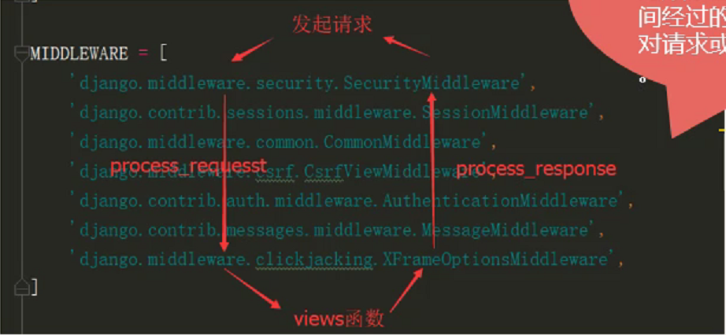

# Django
## 虚拟环境
- `workon`查看虚拟环境
- `mkvirtualenv -p /usr/bin/python3 name`在python3版本下创建虚拟环境
- `workon name`进入虚拟环境
- `deactivate`退出虚拟环境
- `rmvirtualenv name`删除虚拟环境


## 项目初始化
- `django-admin startproject name`在当前目录新建项目
- 目录
    - `manage.py`django的一个命令行工具,管理django项目
    - `__init__.py`空文件,告诉python这个目录是一个python包
    - `setting.py`配置文件,包含数据库信息,调试标志,静态文件等
    - `urls.py`Django项目的URL路由申明
    - `wsgi.py`部署时用到的

- `django-admin startapp name`创建app

## 启动项目
- 项目根目录下`python3 manage.py runserver 0.0.0.0:8000`

## 基础知识
- path规则
    - `path('test/<xx>/',views.test)`
    - 转换器
        - `str`除了/的非空字符串
        - `int`正整数包含0
        - `slug`字符串包含字母数字横杠和下划线
        - `uuid`
    - 参数`xx`与视图中的形参必须一致
- re_path规则
    - `re_path('^hello/$',views.test5)`
    - `re_path('^hello/(?P<yy>[0-9]+)/',views.test6)`

- path中的参数需要在视图中接收(视图中可以使用`**kwargs`)

- `include`
    - 在主`urls`中设置`path('book/',include('book.urls'))`

- 重定向
    - 在path中设置路由的名称`path('xx', views.test, name='t1')`
    - 在视图中`return redirect(reverse('t1'))`

- 展示html
    1. 在根目录设置`templates`
        - 设置`settings`文件中的`TEMPLATES`的`DIRS`属性

    2. 或者在app目录中设置`templates`
        - 在`settings`中注册`INSTALLED_APPS`
        - 保证`settings`中`TEMPLATES`的`APP_DIRS`为`True`
    3. 在视图中`render(request, 'book/index.html')`

- 在视图中传递数据,并在html中展示
    - 传递数据
        ```
        def test1(request):
            return render(request, 'index_test.html',
                        context={
                            'name': 'Sam',
                        })
        ```
    - 展示数据,
    - 注意:函数默认执行并去返回值.过滤器(常用过滤器和时间过滤器)
        ```
        <h2>字典 {{ dict.name }} 今年 {{ dict.age }} 岁了</h2>
        <h2>字典 {{ dict.items }}</h2>
        <h2>函数 {{ fun }}</h2>
        <h2>列表 {{ list1.1 }}</h2>
        <h2>类的方法 {{ fsay }}</h2>
        <h2>元祖 {{ tp.2 }}</h2>

        <h1>{{ name | upper | title }}</h1>
        <h1>{{ num1 | add:num2 }}</h1>
        <h1>{{ dsadad | default:333 }}</h1>
        <h1>{{ list1 | first }}</h1>
        <h1>{{ name | join:dict.age }}</h1> <!-- 拼接 -->
        <h1>{{ list1 | length_is:1 }}</h1>
        <h1>{{ str | truncatechars:5 }}</h1> <!-- 字符串截断 -->
        <h1>{{ str | truncatewords:2 }}</h1> <!-- 单词截断 -->
        <h1>{{ html | truncatechars_html:4 }}</h1>
        <h1>{{ str | slice:'1:3' }}</h1> <!-- 切片 -->
        <h1>{{ html | striptags }}</h1>
        <h1>{{ html }}</h1>
        {{ html | safe }} <!-- 使字符串中的标签生效 -->
        <h1>{{ float | floatformat:2 }}</h1>
        <a href="/">123</a>
        <h1>{{ time }}</h1>
        <h1 id="a1">{{ time | date:'Y/m/d H:i:s' }}</h1>
        ```

- 常用标签
    - `if`标签
        - 语句`if/elif/else/endif/ifequal/ifnotequal`,可以使用`and/or/not/in/<`等运算符
        - 例子
            ```
            
                py1
            
                py
            

            
                <br>
                满足ifequal
            

            
                <br>
                满足ifnotequal
            
            ```
    - `for`标签
        - 语句`for in`
        - `forloop.counter0`当前迭代的次数,下标从0开始(相反于revcounter0)
        - `forloop.counter`当前迭代的次数,下标从1开始(相反于revcounter)
        - `forloop.first`返回布尔值,第一次迭代返回True
        - `forloop.last`
        - `forloop.parentloop`表示上一层循环
        - 例子
            ```
            
                 <!-- 下标>0 -->
                    <br>
                    <a href="">{{ i }}</a>
                
                    <br>
                    {{ i | add:5 }}
                
            
            <br><br>
            
                 <!-- 最后一次迭代 -->
                    <br>
                    <a href="">{{ i }}</a>
                
                    <br>
                    {{ i | add:5 }}
                
            

            
                
                    
                        <br>
                        外层i的值是: {{ forloop.parentloop.parentloop.counter0 }}
                        中层j的值是: {{ forloop.parentloop.counter0 }}
                        内层k的值是: {{ forloop.counter0 }}
                    
                
            
            ```
    - `for in empty`
        - 例子
            ```
            
                    {{ i }}
                
                    empty
            

            ```

    - `url`命令路径
        - 在`urls`中设置路由的名称`path('test5/<p1>', views.test5, name='path_test5')`
        - 在html文件中设置路径`<a href="">进入test5视图</a>`

    - 在html中使用`with`缓存变量
        - 例子
            ```
            
                1111{{ n }}
                2222{{ name }}
            
                3333{{ n }}
                4444{{ name }}
            ```
    
    - 关闭自动转义
        ```
        {{ html }}
        {{ html | safe }}
        
            {{ html }}
        
        ```

    - 注释(如果使用`<!-- -->`则查看源代码可以看到)
        ```
        {# 2 #}
        
            123
        
        ```

    - 继承与引用
        - 创建`base`页面
            ```
            <!DOCTYPE html>
            <html lang="en">
            <head>
                <meta charset="UTF-8">
                <title>base页面</title>
            </head>
            <body>
                
                <h1>我是base页面</h1>
                

                
                
            </body>
            </html>
            ```
        - 创建继承和引用的页面
            - 注意
                1. 模板继承使用extends标签实现。通过使用block来给子模板开放接口
                2. extends必须是模板中的第一个出现的标签
                3. 子模板中的所有内容，必须出现在父模板定义好的block中，否则django将不会渲染
                4. 如果出现重复代码，就应该考虑使用模板
                5. 尽可能多的定义block，方便子模板实现更细的需求
                6. 如果在某个block中，要使用父模板的内容，使用block.super获取
            
            - 例子
                ```
                

                
                    自定义的title内容
                

                
                    通过super继承父类的内容: {{ block.super }}
                    <br>
                    自己创建的内容
                


                
                     {# 引用目标文件body中的内容 #}
                
                ```
        - 设置静态文件
            - 创建静态文件
                - 在app中创建static文件夹
                - 或者在根目录创建static文件夹
            - 在`settings`中设置路径和注册
                ```
                STATIC_URL = '/static/'

                STATICFILES_DIRS = [
                    os.path.join(BASE_DIR, 'static')
                ]

                INSTALLED_APPS = [
                    'django.contrib.admin',
                    'django.contrib.auth',
                    'django.contrib.contenttypes',
                    'django.contrib.sessions',
                    'django.contrib.messages',
                    'django.contrib.staticfiles',
                    'book',
                ]
                ```
            - 在html文件中引用静态文件
                ```
                
                <!DOCTYPE html>
                <html lang="en">
                <head>
                    <meta charset="UTF-8">
                    <title>Title</title>
                    <link rel="stylesheet" href="">
                </head>
                <body>
                
                </body>
                    <script src=""></script>
                </html>
                ```

- 自定义过滤器
    - 目录`common/templatetags`下存放`common_extra.py`文件
    - 在`INSTALLED_APPS`中注册`common`,可以把common看成一个app
    - `common_extra.py`
        ```
        from django import template

        register = template.Library()

        @register.filter # 装饰器注册自定义过滤器1
        def myLower(str):
            return str.lower()

        @register.filter
        def myUpper(str):
            return str.upper()

        # register.filter(myLower) # 注册自定义过滤器2
        ```
    - `html`文件
        ```
         {# 加载自定义py文件 #}
        <!DOCTYPE html>
        <html lang="en">
        <head>
            <meta charset="UTF-8">
            <title>自定义过滤器</title>
        </head>
        <body>
            内置的过滤器: {{ str | lower }}
            <br>
            自定义的过滤器: {{ str | myLower }}
            <br>
            自定义的过滤器: {{ str | myUpper | cut:' ' | slice:'1:5'}}
        </body>
        </html>
        ```

- 自定义标签
    - 简单标签(simple_tag)
        - 在`common_extras.py`中
            ```
            from django import template

            register = template.Library()

            @register.simple_tag # 注册标签
            def current_time(format_string):
                format_string = format_string or '%Y年%m月%d月 %H点%M分%S秒'
                return datetime.datetime.now().strftime(format_string)

            @register.simple_tag(takes_context=True) # 注册标签,并且直接接收视图的参数
            def current_time2(context):
                format_string = context.get('t')
                return datetime.datetime.now().strftime(format_string)
            ```
        - 在`html`中
            ```
            
            
            ```
    
    - 包含标签
        - 在`common_extras.py`中
            ```
            @register.inclusion_tag('show_tag.html') # 注册包含标签
            def show():
                learn = ['python1', 'javascript1', 'html1']
                return {'learn': learn}

            @register.inclusion_tag('show_tag.html') # 注册包含标签
            def show2(xx):
                return {'learn': xx}

            @register.inclusion_tag('show_tag.html', takes_context=True) # 注册包含标签
            def show3(context):
                xx = context.get('l') # 从上下文获取l
                return {'l': xx}
            ```
        - 在`show_tags`html中
            ```
            <ul>
                
                    <li>{{ i }}</li>
                
            </ul>
            ```

        - 在实际使用的html中
            ```
            
            
            
            ```

## 模型基础
- ORM概念
    - 对象关系映射
    - ORM的优势:不用直接编写SQL代码,只需要操作对象一样操作数据
    - 一个数据表对应一个模型类,表中的字段对应类属性

- 配置数据库连接`settings.py`并注册app
    ```
    DATABASES = {
        'default': {
            'ENGINE': 'django.db.backends.mysql',
            'NAME': 'mydb', # 数据库的名称
            'USER': 'admin',
            'PASSWORD': 'sa',
            'HOST': '132.232.110.71',
            'PORT': '3306'
        }
    }
    ```

- 项目目录的`__init__`文件
    ```
    import pymysql
    pymysql.install_as_MySQLdb()
    ```

- 创建模块`models`
    ```
    # movie_user表示一张表
    class User(models.Model):
        id = models.AutoField(primary_key=True) # 自增长主键
        name = models.CharField(max_length=30)
        age = models.IntegerField()
        # 新增字段
        city = models.CharField(max_length=50, default='')
    ```

- 创建映射文件
    - `python manage.py makemigrations`

- 将映射文件中的数据提交到数据库中
    - `python manage.py migrate`

- 多种方式添加数据并保存
    ```
    def add_user(request):
        # 方法一
        # user = User(name='sam', age=18, sex=1)
        # user.save()

        # 方法二
        # user = User()
        # user.name = 'Jack'
        # user.age = 20
        # user.sex = 0
        # user.save()

        # 方法三
        # User.objects.create(name='Ros', age=22, sex=1)

        # 方法四
        User.objects.get_or_create(name='Mar', age=24, sex=0) # 不会重复创建

        return HttpResponse('插入数据')
    ```

- 查询数据
    ```
    def search_user(request):
        # QuerySet: 支持切片,不支持负索引

        # .all返回QuerySet对象(数据库查询的集合)
        # result = User.objects.all()
        # print(result)
        # print(result[:2])

        # .get加条件只能返回一个实例对象(条件对应的结果必须唯一)
        # result = User.objects.get(name__contains='M')
        # print(result)

        # .filter加条件查询,返回QuerySet类型
        result = User.objects.filter(id__gte=3)
        print(result[0])

        # 常用的查询方法
        rs = User.objects.all()
        rs = User.objects.first() # 实例对象
        rs = User.objects.last() # 实例对象
        rs = User.objects.filter(name='sam') # 返回QuerySet
        rs = User.objects.exclude(name='sam') # 反向查询
        rs = User.objects.get(name='sam') # 获取唯一的一条数据
        rs = User.objects.order_by('-age') # 逆向排序
        rs = User.objects.order_by('age', 'id') # 多项排序
        rs = User.objects.all().values() # 将QuerySet转换成字典
        rs = User.objects.count()

        return HttpResponse(result)
    ```

- 更新数据
    ```
    def update_user(request):
        # rs = User.objects.get(id=6)
        # rs.age += 1
        # rs.save()

        # rs = User.objects.filter(id=6)
        # print(rs)
        # rs.update(age=26) # 如何age+=1

        # rs = User.objects.all()
        # rs.update(city='cd')


        return HttpResponse('修改数据')
    ```

- 删除数据
    ```
    def del_user(request):
        # 实例对象的删除
        # rs = User.objects.get(id=6)
        # rs.delete()

        # QuerySet对象的删除
        # rs = User.objects.filter(id=7)
        # rs.delete()
        # User.objects.all().delete()

        return HttpResponse('删除数据')
    ```

- 删除表
    - 注释`models.py`文件中的类(即表)
    - 执行`makemigration`和`migrate`

- 常见的查询条件
    - `exact`等于
    - `iexact`忽略大小写的等于
    - `contains`包含
    - `icontains`忽略大小写的包含
    - `startwith`以什么开始
    - `istartwith`忽略大小写 以什么开始
    - `endswith`
    - `iendswith`
    - `in`
        - `.filter(age__in=[20,21,22])`
    - `gt`大于
    - `gte`大于等于
    - `lt`小于
    - `lte`小于等于
    - `range`区间
    - `isnull`判断是否为空

- 常用字段和参数
    - 字段
        - id(默认) -> AutoField
        - varchar -> CharField
        - int -> IntegerField
        - longtext -> TextField
        - date -> DateField 日期
        - datedatetime -> DateTimeField 日期时间
        - tinyint -> BooleanField
    - 参数
        - primary_key
        - max_length
        - unique
        - null
        - blank 为True时form表单验证时可以为空,默认为False
        - default
        - auto_now 类似于updateTime,注意:update方法不能更新时间,需要用save方法
        - auto_now_add 类似于createTime

- 表关系创建
    - 一对多 -> 外键 -> ForeignKeyField
    - 一对一 -> 外键+唯一键 -> OneToOneField
    - 多对多 -> 关联表:外键+联合唯一 -> ManyToManyField
    - 参数
        - 级联删除`on_delete=models.CASCADE`表示如果主表中Department中学院被删除,则这个外键表中的数据也要同时被删除
    - 例子
        ```
        class Department(models.Model):
            d_id = models.AutoField(primary_key=True)
            d_name = models.CharField(max_length=30)
            create_time = models.DateTimeField(auto_now_add=True)
            update_time = models.DateTimeField(auto_now=True)

        class Student(models.Model):
            s_id = models.AutoField(primary_key=True)
            s_name = models.CharField(max_length=30)
            department_id = models.ForeignKey('Department', on_delete=models.CASCADE) # 级联删除: on_delete=models.CASCADE 表示如果主表中Department中学院被删除,则这个外键表中的数据也要同时被删除
            create_time = models.DateTimeField(auto_now_add=True)
            update_time = models.DateTimeField(auto_now=True)

        class Course(models.Model):
            c_id = models.AutoField(primary_key=True)
            c_name = models.CharField(max_length=30)
            student = models.ManyToManyField('Student') # 这一行会生成一个表,course-student

        class stu_detail(models.Model):
            s_id = models.OneToOneField('Student', on_delete=models.CASCADE)
            age = models.IntegerField()
            gender = models.BooleanField(default=1)
            city = models.CharField(max_length=100, null=True)
        ```

- 关系表的数据操作
    ```
    from django.db.models import Count, Avg, Max, Min, Sum

    def test(request):
        # 新增
        # Department(d_name='计算机学院').save()
        # Department(d_name='外国语学院').save()
        # Department(d_name='艺术学院').save()

        # 新增数据
        # s1 = Student(s_name='张三', department_id_id=1)

        # 新增数据,并为外键赋值
        # d1 = Department.objects.get(d_id=1)
        # s1 = Student(s_name='李四')
        # s1.department_id = d1 # 外键是一个实例
        # s1.save()

        # c1 = Course(c_name='Python')
        # c1.save()
        # Course.objects.create(c_name='Java')


        d1 = Department.objects.get(d_id=1) # 计算机学院
        s1 = Student.objects.get(s_id=2) # 张三
        c1 = Course.objects.get(c_id=1) # Python
        c2 = Course.objects.get(c_id=2) # Java
        s2 = Student.objects.get(s_id=3) # 李四
        #
        # print(d1.student_set.all()) # 查询计算机学院d1在学生表中有多少条数据外键关联
        # print(s1.department_id_id)

        # add
        # d2 = Department.objects.get(d_id=2) # 外国语学院
        # d2.student_set.add(s1) # 将s1这个学生的外键改为外国语学院

        # create
        # d1.student_set.create(s_name='王五') # 添加一个学生,外键是计算机学院
        # s1.course_set.create(c_name='Node') # 添加一个课程,并在中间信息表中把学生和课程关联

        # add
        # c2.student.add(s2) # 在中间表添加关系

        # remove
        # s2.course_set.remove(c2) # 删除关联表信息

        # clear
        # s1.course_set.clear() # 清空关联表中所有s1的数据

        # 多表查询
        Student.objects.filter(department_id__d_name='外国语学院') # 在学生表中查询名称为外国语学院的学生信息
        Department.objects.filter(student__s_name__contains='李') # 查询学生名字中包含xx的学院名称
        Department.objects.filter(student__course__c_name='Node')# 查询报了Node课程的学生的所属学院的信息

        # 聚合查询
        rs = User.objects.add().aggregate(Avg('age'))
        
        Student.objects.all().values('department').annotate(count=Count('department)).values('department', count) # 统计学院里学生的数量
        # select count(*) 学生数量, department_id_id 学院ID from student_student ss GROUP BY department_id_id;

        return HttpResponse('test')
    ```    

## 请求与相应
- 请求
    - 头
        - `path` 路径,不包含域名
        - `method` 请求方法
        - `encoding` 编码方式
        - `GET` 类似于字典的对象,包含get请求的参数
        - `POST` 类似于字典的对象,包含post请求方式的所有参数
        - `FILES` 一个类似于字典的对象,包含所有的上传文件
        - `COOKIES` 一个标准的Python字典,包含所有的cookie,键值均为字符串
        - `session` 一个既可读又可写的类似于字典的对象,表示当前的会话,只有当Django启用时才可用
        - `is_ajax()` 判断是否是ajax请求
    - 方法
        ```
        print(request.GET.get('a')) # 拿到一个值
        print(request.GET.getlist('a')) # 拿到一个集合
        print(request.path)
        print(request.method)
        print(request.COOKIES)
        ```
- 响应
    - `HttpResponse()`返回简单的字符串对象
    - `render()` 渲染模板
    - `redirect()` 重定向
    - `JsonResponse()`返回json数据
    - 头
        - `content` 返回的内容,字符串类型
        - `charset` response采用的编码类型
        - `status_code` 响应状态码
        - `content-type` 指定输出的MIME类型
    - 方法
        ```
        def test_json(request):
        a = request.GET.get('a')
        if int(a) == 2:
            return JsonResponse({
                'abc': 321
            })
        else:
            return JsonResponse({
                'error': '400'
            })
        ```
## 文件上传
    ```
    from test_project.settings import MEDIA_ROOT
    def upload(request):
        if request.method == 'GET':
            return render(request, 'upload.html')
        elif request.method == 'POST':
            f1 = request.FILES['file'] # file是表单中的name值
            fs_name = os.path.join(MEDIA_ROOT, f1.name)
            with open(fs_name, 'wb') as f:
                for c in f1.chunks():
                    f.write(c)
            return HttpResponse('数据存入成功')

    ``` 
    
## cookie和session
- cookie
    ```
    def set_ck(request):
        response = HttpResponse('setcookie')
        response.set_cookie('a', 1)
        return response

    def get_ck(request):
        response = HttpResponse('getcookie')
        cookie = request.COOKIES
        print(cookie.get('a'))
        return response

    def del_ck(request):
        response = HttpResponse('delCookie')
        response.delete_cookie('a')
        return response
    ```

- session
    - 在settings的installed_apps默认启用
    - 在django_session表中保存session信息
    - 默认两个星期过期
    - 保存登录状态
        ```
        # 主页
        def home(request):
            username = request.session.get('username')
            return render(request, 'home.html', context={
                'username': username
            })


        # 登录
        def login(request):
            if request.method == 'GET':
                return render(request, 'login.html')
            elif request.method == 'POST':
                username = request.POST.get('username')
                password = request.POST.get('password')

                # 用session保存状态,存入django-session表中
                # 把表中的sessionid存入客户端的cookie中
                request.session['username'] = username
                return redirect(reverse('home'))

        # 退出
        def logout(request):
            request.session.flush()
            return redirect(reverse('login'))
        ```
    - 注册登录
        - 注册
            - views
                ```
                from .forms import RegisterForm, LoginForm
                from .models import UserModel
                # 注册
                def register(request):
                    if request.method == 'GET':
                        form = RegisterForm() # 实例化表单
                        return render(request, 'register.html', context={
                            'form': form
                        })
                    elif request.method == 'POST':
                        form = RegisterForm(request.POST)
                        # 如果form表单信息合法
                        if form.is_valid():
                            username = form.cleaned_data.get('username')
                            password = form.cleaned_data.get('password')
                            password_repeat = form.cleaned_data.get('password_repeat')
                            email = form.cleaned_data.get('email')
                            if password_repeat == password:
                                UserModel.objects.get_or_create(username=username, password=password, email=email)
                                return HttpResponse('注册成功')
                            else:
                                return HttpResponse('注册失败')
                        else:
                            print(form.errors)
                            return HttpResponse('注册失败')
                ```
            - forms
                ```
                class RegisterForm(forms.Form):
                    username = forms.CharField(
                        max_length=10,
                        min_length=4
                    )
                    password = forms.CharField(
                        max_length=20,
                        min_length=6,
                        widget=forms.PasswordInput(
                            attrs={'placeholder': '请输入密码'}
                        )
                    )
                    password_repeat = forms.CharField(
                        widget=forms.PasswordInput()
                    )
                    email = forms.EmailField()
                ```

        - 登录
            - views
                ```
                def loginxx(request):
                    if request.method == 'GET':
                        form = LoginForm()
                        return render(request, 'login1.html', context={
                            'form': form
                        })
                    elif request.method == 'POST':
                        form = LoginForm(request.POST)
                        if form.is_valid():
                            username = form.cleaned_data.get('username')
                            password = form.cleaned_data.get('password')
                            user = UserModel.objects.filter(username=username)
                            if user:
                                if password == user[0].password:
                                    request.session['username'] = username
                                    return redirect(reverse('home'))
                                else:
                                    return render(request, 'login1.html', context={
                                        'form': form,
                                        'error': form.errors
                                    })
                            else:
                                return redirect(reverse('register'))
                ```
            - forms
                ```
                class LoginForm(forms.Form):
                    username = forms.CharField(max_length=10, min_length=4)
                    password = forms.CharField(max_length=20, min_length=6)
                ```

## 中间件
- Django中间件是一个轻量级的插件系统,可以介入Django的请求和响应处理过程,修改Django的输入和输出
- settings中的MIDDLEWARE_CLASSES



- 第一种方法
    - 在主目录中创建mymiddleware
        ```
        from django.utils.deprecation import MiddlewareMixin

        class MyException(MiddlewareMixin):
            def process_exception(self, request, exception):
                print('自定义异常')
                return HttpResponse(exception)
        ```
    - 在MIDDLEWARE中注册
        - `'test_project.mymiddleware.MyException'`

- 第二种方法
    - 主目录的mymiddleware中设置
        ```
        from test_project.register.models import user
        class UserMiddleware:
            def __init__(self, get_response):
                self.get_response = get_response

            def __call__(self, request):
                # request到达view视图之前执行的语句
                username = request.session.get('username', '未登录')
                userinfo = user.objects.filter(username=username).first()
                if userinfo:
                    setattr(request, 'myuser', userinfo.username)
                else:
                    setattr(request, 'myuser', '未登录')

                response = self.get_response(request)

                # response到达用户浏览器之前执行的语句
                return response
        ```
    - 在MIDDLEWARE中注册

## 上下文处理器
- 例如需要在每个视图中传递session信息
- settings中的TEMPLATES保存着上下文处理器
- 在主目录中设置mycontextprocess
    ```
    from test_project.register.models import user

    def myuser(request):
        username = request.session.get('username', '未登录')
        userinfo = user.objects.filter(username=username).first()
        if userinfo:
            return {'myuser': userinfo.username}
        else:
            return {}
    ```
- 在TEMPLATES中注册


## django admin系统
- `python3 manage.py createsuperuser`
- 在app的admin文件中
    ```
    from django.contrib import admin

    from .models import Department, Student, Course, stu_detail

    class dep_admin(admin.ModelAdmin):
        list_display = ['d_id', 'd_name']
        list_display_links = ['d_id', 'd_name']

    admin.site.register(Department, dep_admin)
    ```

## auth系统
- `auth`数据库中开头的表
